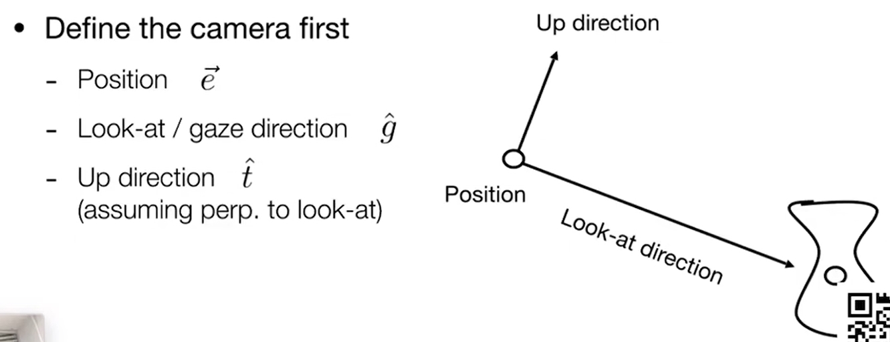
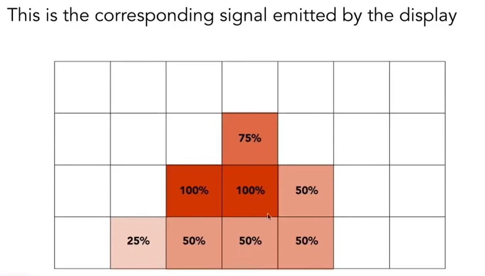
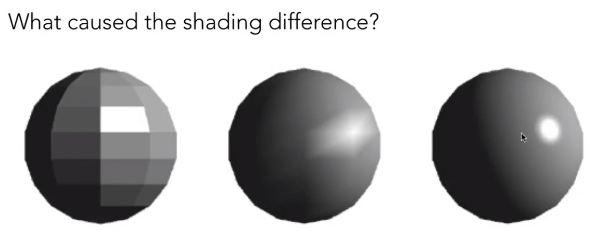
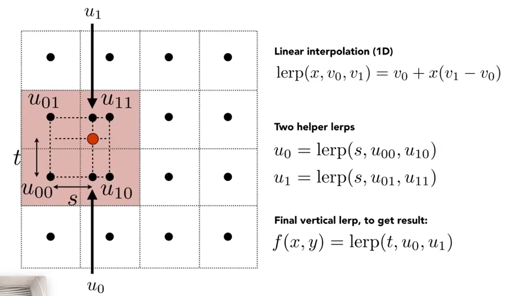
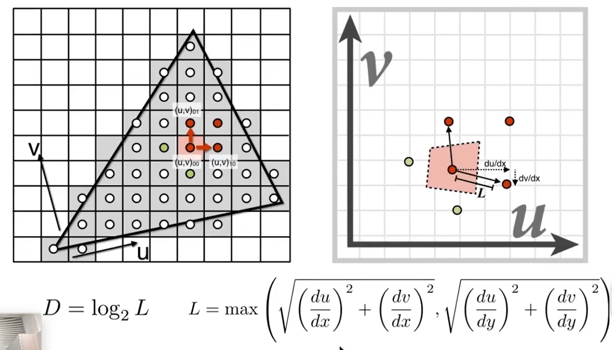
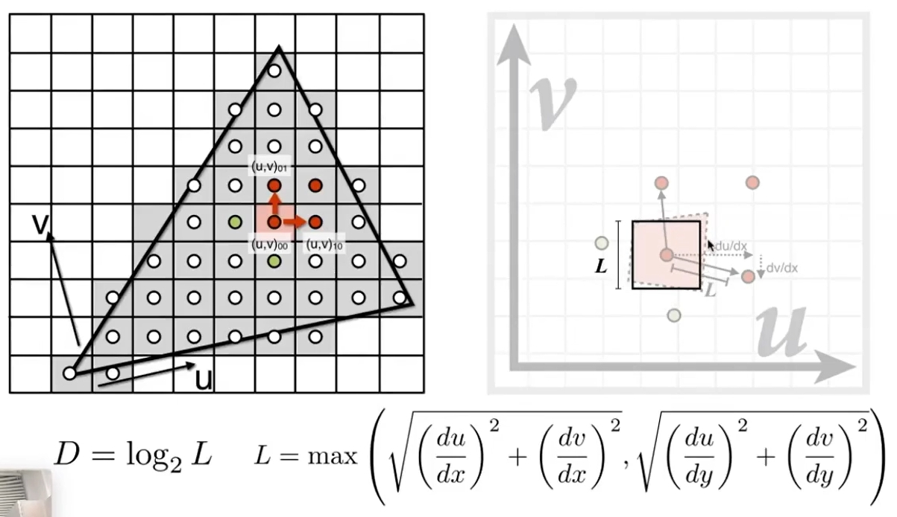
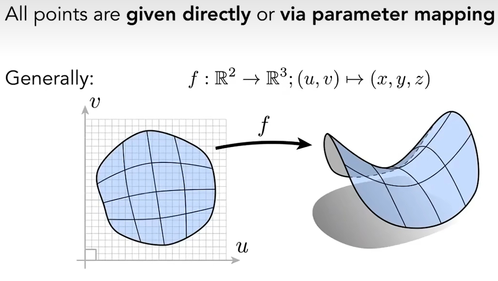
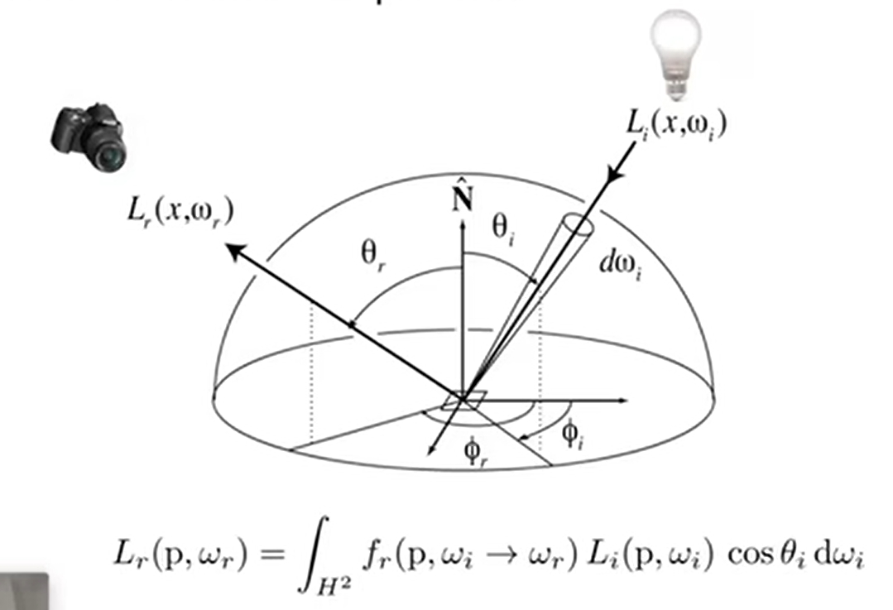

# GAMES101-现代图形学入门

[TOC]

## Lecture 1:Overview of Computer Graphics
### 1.什么是好的画面？
* 直观的标准就是看画面是否足够亮，体现的是渲染中的关键技术：全局光照，画面做的好，整个画面就会亮，看起来很舒服
### 2.VR/AR的区别
* 虚拟现实是看不到现实的，头戴式设备内看到的东西都是电脑生成的；增强现实，可以看到现实的环境，并会看到新的电脑生成的东西显示在画面里面
### 3.图形学≠计算机视觉
* 计算机视觉，一切需要进行猜测的内容，比如语义分割（分割出来哪些是人哪些是道路），目标检测（推理找出某个目标对象）希望计算机能以视觉的方式进行分析理解、推断推理。在本课程中不会涉及，不属于图形学的范畴
* 二者的结合越来越紧密，界限也越来越模糊

### 4.随记
#### The Quick Brown Fox Jumps Over The Lazy Dog
* 这句话里面包含了26个字母，所以常用于Typography的测试，会出现一遍大写一遍小写，可以测试一个字体的美感和完整性
#### Learn Graphics ，Not Graphics API

#### Geek
* Geek = Genius✔ + Freak❌
#### Tradeoff思想
* No Free Lunch，没有免费的午餐
* 在两个或多个竞争性或矛盾的选择之间进行权衡或取舍的行为，例如：时间复杂度vs空间复杂度
## Lecture 2:Review of Linear Algebra
### 0.阅读材料
* Tiger Book : 第2章Miscellaneous Math、第5章Linear Algebra
### 1.Vectors
#### 1.1基本概念
* 数学上叫向量、物理上叫矢量，含有两个重要的属性：方向和长度
* 向量平移到不同位置，依然是一个向量，因为向量间两点AB的相对位置并没有改变，并不关心向量的绝对开始位置
* 向量的长度：若长度为1，则称为单位向量。任一向量想要变为单位向量，用向量本身去除以其长度，就可以得到一个和原始向量同方向，且长度为1的一个单位向量

#### 1.2 Vector Addition
* 平行四边形法则：在几何上的表述方式，向量间尾部相接
* 三角形法则：在几何上的表述方式，向量间首尾相接
* 笛卡尔坐标：在代数上的表述方式
#### 1.3 Vector Multiplication
* Dot(scalar) product：点乘最后得到的是一个数  
	a、应用：1、可以通过点乘快速的得到两个向量间的夹角（计算光线入射的夹角、物体表面的法线、摄像机目视角度等）2、将一个向量投影到另一个向量上 3、通过点乘判断多个向量的方向相近或相离
  
* Cross(vector) product：叉乘得到的是一个向量
	a、向量的叉积并不满足交换律，若要交换顺序需要加个负号  
	b、右手螺旋定则（right-handed）：bxa，则除大拇指外从b芳香手指并列卷向a，则此时大拇指指向的方向为叉积后的方向  
	c、向量的叉乘可以表示成矩阵形式  
  
	d、应用：1、判断左和右（叉乘得到的结果为正，则在左侧，若为负则在右侧） 2、判断内与外（叉乘的结果都在封闭图形各边的左边，则在该封闭图形的内部，否则在外部）
* Orthonormal bases and coordinate frames.
### 2.Matrices
#### 2.1基本概念
* 矩阵就是一组m行n列的数
* 矩阵相乘要遵循“第一个矩阵的列数等于第二个矩阵的行数”这个原则
#### 2.2 Matrix-Matrix Multiplication
* 矩阵的相乘依然不满足交换律
#### 2.3 Matrix-Vector Multiplication
* 将向量看作一个m * 1的矩阵
* 求一个向量关于y轴对称的镜像

#### 2.4 Transpose of a Matrix
* 两个矩阵乘积的转置 = 各自转置矩阵的乘积（次序颠倒AB->BA）
#### 2.5 Identity Matrix and Inverses
* 单位矩阵：对角线上为1，其他均为0的矩阵
* 逆矩阵：一个矩阵A如果和另一个矩阵B相乘得到单位矩阵，则矩阵B称为矩阵A的逆矩阵
* 两个矩阵的乘积的逆矩阵 = 各自逆矩阵的乘积（次序颠倒AB->BA）
#### 2.6 Vector multiplication in Matrix form
* 用矩阵的形式表示向量乘积

## Lecture 3:Transformation
### 0.名词解释
* Transformation：变换
* Modeling：模型变换
* Viewing：视图/观测变换
* Shear：切变
* Homogeneous coordinates：齐次坐标
### 1. 2D transformations
#### 1.1 Scale Transform（Uniform/Non-Uniform）
* sx，sy分别为x轴和y轴上的缩放的倍率，则其中由sx，sy和0组成的矩阵称之为缩放矩阵Scale Matrix

#### 1.2 Reflection Transform
* Reflection Matrix

#### 1.3 Shear Transform
* Shear Matrix

#### 1.4 Rotate Transform
* 讨论基准：不特殊说明默认绕零点（0，0）旋转，默认按逆时针方向旋转
* Rotate Matrix，如果是负角度，则旋转矩阵为该旋转矩阵的转置
* 从定义中可知，旋转θ角度和旋转-θ角度的旋转矩阵相乘为单位矩阵，则我们又可以发现，所以在旋转矩阵中，旋转矩阵的转置就等于旋转矩阵的逆矩阵
* 在数学上，如果某个矩阵的转置等于该矩阵的逆矩阵，则我们又称它为正交矩阵。所以旋转矩阵就是一种正交矩阵

* 推导过程

#### 1.5 Linear Transforms = Matrices
* 可见，线性变换都可以用矩阵的形式进行表达
* 前提：相同维度
### 2. Homogeneous coordinates
#### 2.1 Why Homogeneous coordinates

* 可以发现平移变换之后，无法直接的写为一个向量和矩阵相乘的形式了，可以在上面的2D变换的基础上通过和另一个向量的相加减实现描述。这也反映出来平移变换不是一个线性变换
* 但人类总是懒惰的，并不想把平移变换当作一个特殊的变换，是否有某种统一方式能将所有的变换包括进来？这就是齐次坐标
#### 2.2 Solution:Homogeneous coordinates

* 给二维向量或点增加第三维，使得平移操作能用一个矩阵乘以一个向量的方式进行表达
* 二维点增加第三维为1，二维坐标增加第三维为0（保护向量具有平移不变性）
* tradeoff的代价就是增加了维度进行存储额外的0 0 1
* 变换的执行顺序是先进行线性变换再进行平移
#### 2.3 Affine Transformations
* 放射变换 = 线性变换 + 平移，可以用齐次坐标表示如下，可见在二维变换的情况下最后一行永远为0, 0 ,1，最后一列永远为平移变换的距离tx，ty , 1

#### 2.4 Inverse Transform
* 逆变换：之前所作变换的逆矩阵
#### 2.5 Composite Transform
* 矩阵间乘操作的顺序不一样，出来的效果也会不一样，也反映出矩阵是不满足交换律的
* 矩阵的执行顺序：从右到左
* 但别忘了矩阵是有结合律的，可以先对矩阵进行计算，合成得到一个矩阵，再和点进行相乘
#### 2.6 Decomposing Complex Transform
* 一个复杂的变换可以分解为若干个简单的变换来实现，例如：先平移回原点再进行其他操作，完成后再从原点平移回出发点即可
### 3. 3D Transformations
* 同理，在三维坐标中也可以用齐次坐标的形式对点和向量进行升维，用4 * 4的矩阵进行仿射变换的表示，4 * 4矩阵的最后一行永远为0 ，0 ，0 ，1，最后一列永远为平移变换的距离tx，ty , tz ，1，左上角的3 * 3为三维空间中的线性变换过程
* 3 * 3的执行顺序是先进行线性变换，再进行平移，所以如果是点左乘一个线性变换矩阵，再左乘一个平移矩阵，是可以写在一起的
 
#### 3.1 Rotate Transform
* 三维空间的旋转先从简单的绕坐标轴进行旋转看起，例如在绕x轴进行旋转的时候，三维点的x值是不变的，y和z的值会进行改变，则只对y和z进行旋转，变成了一个二维空间上的旋转问题，所以第一行第一列为1，该行该列其余位置均为0.
* 同理，绕y轴旋转时，第二行第二列为1，该行该列其余位置均为0；绕z轴旋转时，第三行第三列为1，该行该列其余位置均为0
* 可见在绕y轴进行旋转时，区别于绕x轴和绕z轴旋转，sinα的正负号反了过来，是因为基于xyz的顺序，前两个向量叉乘能得到下一个，则向量y是由z向量叉乘x向量得到的，所以它的负号是反过来的
 
#### 3.2 3D Rotations
* 对于一般性旋转则可以转换为简单旋转的组合
* Euler angles：欧拉角，roll（翻滚角）、pitch（俯仰角）、yaw（旋转角）
 
* Rodrigues’ Rotation Formula：罗德里格斯旋转公式，n为旋转轴，α为旋转角度，沿着某一个轴旋转，默认过原点，将原点作为起点
 
* 对于复杂任意轴同样是进行分解
* quaternions四元数：计算旋转矩阵与旋转矩阵之间的差值，该课程不进行讲解及运用
## Lecture 4:Transformation Cont
### 0.名词解释
* Projection：投影
* Orthographic：正交
* Perspective：透视
### 1.Viewing Transformation
* MVP变换：model transformation -> view transformation -> projection transformation，模型->视图->投影
#### 1.1 View/Camera transformation
* 放置相机的三个要素：1、位置e 2、向上的朝向t 3、上下所看的角度g，这三个元素就构成了观测矩阵，向上的朝向可以理解为欧拉角中的roll翻滚角，（人拿着相机侧身弯腰，拍到的水平画面会倾斜）
 
* 当相机和所有的物体移动的速度、方向都相同时，即不产生相对运动的情况下，相机所拍出的照片是相同的
* 为了简化操作，人们就将相机固定放在原点（0，0，0）上，在y轴上永远向上看，在z轴上永远向-z的方向看，这个称为相机的标准位置
* 则将相机放置在标准位置上的过程在数学上可以表示为：（1）将位置e平移到原点上（2）将所看的角度g旋转到-Z（3）将向上的朝向t旋转到Y（4）将g叉乘t旋转到X
 
* 将上述操作用矩阵的方式表达，这里由于要先到原点，所以先做平移。但是正操作过程不太好写，如果是从原点出发做逆操作就好写了,也就是X->(g x t)，Y->t,Z->-g。又因为旋转矩阵是正交矩阵，所以直接对内部的3 * 3变换部分进行转置即可
 
#### 1.2 Projection transformation
* 正交投影更多用于工程制图，不会带来近大远小的现象；人眼的成像会更接近透视投影，看到的平行线不平行会相交到某个地方去，一叶障目，经典图片“鸽子那么大”
 
* 透视投影，认为摄像机放在某一个位置上作为一个点，点与画面连出空间上的一个四棱锥，四棱锥中某一个深度到另一个深度之间的区域称之为frustum（视锥体），把这块区域中的所有东西显示在近处平面上
* 正交投影，则认为将相机拿到足够远的位置，则此时发现近处和远处的平面一样的大小，无论物体有多远，投影到平面上的东西都是一样的
##### 1.2.1 Orthographic projection
* 具体的做法：（1）将相机放到标准位置（2）然后把Z轴丢掉，此时所有的东西都在xoy平面上了（3）最后不管xy的范围多大，都缩到[-1,1]之间（约定俗成，方便后续的计算），就得到了正交投影的结果，一个[-1,1]^3的canonical cube，此时物体在里面会被拉伸，后续还要做一个视口变换，后续会提及
* 更正式的说法：不管空间上多少长宽高的长方体，都可以正则成一个标准的立方体，做法：先平移到原点，再缩放
 
* 注意在z轴上，实际上是越远的值比越近的值越小
* Transformation Matrix：其中平移部分（r+l）/2为x轴上左和右的中心，负号是因为要把一个点往原点方向移动，无论是正负数都是负号，其他的类似；缩放部分中2/（r-l）做的是缩放操作，2是因为-1到1的距离为2，其他的类似
 
* 网上看到的结果和这里不一样是正常的，可能是使用的坐标系不同，比如OpenGL使用的左手系
##### 1.2.2 Perspective projection
* 透视投影，使用最广泛，近大远小。
* 实现透视投影的过程可以理解为，（1）将远端平面上的四个点往近平面上面挤，将frustum视棱锥挤成一个长方体（2）再做一次正交投影
* 上文已经知道了第二步正交投影怎么做了，那么第一步“挤”的过程怎么做，首先先规定几个规则，（1）近平面的位置永远不变，该平面下任何一个点都不会变（2）远处的平面，在经过挤压后，z值（即深度）依然不变（3）远平面最中心的点，在经过挤压后，其位置仍然在最中心（0，0，f）三个轴的值都不变
 
* 从透视->正交的矩阵M[persp->ortho]求解过程如下所示，
	a、下图为侧视图，左边的zoy是相机拜放的位置，向-z的方向看，只看z方向的话可以得到一个相似三角形，根据相似三角形原理，可以通过(x,y,z)和底边n、z等距离信息,n和z的比值，可以求出挤压后的y'
	 
	b、同理，通过从相机从前往后看的视角，x'也可以通过相似三角形定理求出来。此时在齐次坐标系下，我们可以得到如下的一个变换过程，由于z是怎么变的还不知道所以先写为unknown，一个点同时缩放z倍后仍然是同一个点  
   
	c、此时，从透视到变换的结果已经知道了，我们可以填出变换矩阵的部分信息，比如第一行第一列第二行第二列，涉及x，y变换的部分一定是n，第四行第三列一定是1
	 
    d、结合我们前面的三条规则，近平面上任何点不变和远平面上的z不变。根据第一条规则近平面上任何点不变，代入近平面上的点（x,y,n）,缩放n倍，依然是原本那个向量，此时知道了unknown,此时已经得出来变换矩阵的第三行部分信息，前两位必为0，因为n^2和x,y没有任何关系，但无法确认第三列第四列的A和B是n 0 还是0 n^2  
	
	e、根据第三条规则，远平面上的中心点，无论怎么挤压仍然在中心点（0，0，f）,代入结合上一步中的An+B=n^2，可以解出A=n+f,B=-nf，此时已经得到了完整的透视到变换矩阵
	
* 最后再做一个正交投影即可
* 思考：对于近平面和远平面中间的某一个点，经过挤压的点，它的z是会变小还是变大？
* 如何定义一个视锥？定义一个可视角度，定义一个宽高比
* Vertical Field of View：可视角度，定义看到的视界。广角相机就是可视角度比较大，视棱锥扩张的更大。垂直可视角度就是从相机出发到顶边和底边连线的夹角，
* 此时我们可以通过垂直可视角度的一半，结合平面和相机的距离n的绝对值，正切计算出顶部高度top值，结合宽高比可以算出宽度

## Lecture 5:Rasterization 1 (Triangles)
### 0.名词解释
* Rasterization：光栅化，三维空间的几何形体显示在平面上就叫做光栅化，实时图形学中会广泛的应用到
* 实时图形学：当一秒钟能生成30张画面，也就是fps达到30，否则称为offline离线图形学
* Sampling：采样
* Jaggies：锯齿
* Aliasing：信号走样
### 1.Canonical Cube to Screen
* 在我们通过MVP的透视变换得到一个canonical cube后我们要把它画在屏幕上
##### 1.1 What is screen
* 屏幕是一个二维的数组，数组中的每一个元素是一个像素Pixel，屏幕的大小称之为分辨率，代表像素的多少
* 屏幕是典型的光栅成像设备，Raster光栅是德语中的一个词，就是屏幕的意思，光栅化则是把东西画在屏幕上的意思
#### 1.2 Canonical Cube -> Screen
* 三维的怎么映射到二维？先不管z，x和y映射到width和height中，变换矩阵如下，该变换也被称为视口变换Viewport，把[-1,1]^2映射到屏幕空间。左上角的3 * 3 对角阵将宽度变为width，高度变为height,z方向不变;第四列的平移部分把原本在canonical cube原点的中心移动到屏幕中心（width/2,height/2）

### 2.Raster Displays
#### 2.1 LCD(Liquid Crystal Display) Pixel
* 液晶显示器，液晶通过不同的排布扭曲影响光的极化（光的偏振方向），调整光的振动方向，液晶显示器两侧有两个光栅，通过了一个光栅后，光的振动方向和光栅的振动方向一致

### 3.Drawing to Raster Displays
#### 3.1 Why trangles
* 三角形是最基础的多边形，没有比三角形边更少的多边形了，任何其他的多边形都可以拆成若干个三角形
* 三角形给定三个点，连成一个三角形一定是在一个平面的，而四边形对角线一折，就不在一个平面了
* 三角形内外部定义清楚，不存在凸凹多边形的说法，且可以通过向量的叉积定义一个点是否在三角形内
* 三角形内部的任意点和其三个顶点可以得到一个逐渐的变化得到插值，中心坐标的插值方法
#### 3.2 Sampling
* 光栅化的核心问题：一个像素里面只可能有一个值，如何判断一个像素的中心点和所要绘制的三角形的位置关系
* 采样：给定一个连续函数，在不同的地方问这个函数的值是多少的过程，采样就是把一个函数离散化的过程
* 采样判断屏幕内的每个像素中心是否在三角形内，可以定义一个函数如下，其中x,y不一定是整数，是实数即可

* inside函数如何实现？结合之前提到的向量间的叉积判断点在多边形内/外，如下图所示。默认向量方向为逆时针，P1P2与P1PQ叉乘，根据右手定则，得到一个向屏幕外的向量，z是正的，则Q在P1P2左侧；同理叉乘P0P1、P0PQ得到Q在P0P1左侧；最后叉乘P2P0和P2Q，发现Q在P2P0右侧；叉乘的结果不都在同侧，则在该三角形外部

* 若刚好有一点在两个三角形的相接边界上，则可以自己定义要么不做处理，要么做特殊处理，本课程不作处理。比如OpenGL认为点落在多边形的上边和左边上都认为在多边形内，落在右边和下边则不算在多边形内
* 对于inside函数的运用，为了提高速度，不必要将这个宽高屏幕遍历一遍，将要填充覆盖的最小包围区域AABB（Axis-Aligned Bounding Box，轴对齐边界框）遍历就好。更快的办法是只找绘制三角形每行只涉及的像素坐标
* 那么填充后一个三角形会变成如下的一个图，存在大量的锯齿Jaggies，光栅化中致力于解决的问题，产生的原因是采样的频率对于该信号来说还不够高，产生信号走样的问题Aliasing，解决方案就是抗锯齿/反走样

#### 4.随记
* Real LCD Screen Pixels（Close up）:可以看到右侧的图，这种RGB的排列方式称为Bayer Pattern，将传感器上的像素排列成一种特定的格点模式，绿色的点密度比蓝色和红色的更高，是因为人眼对于绿色更为敏感。很多相机也是这样设置的

## Lecture 6:Rasterization 2（Antialiasing and Z-Buffering）
### 0.名词解释
* Artifacts：瑕疵，Errors/Mistakes/Inaccuracies一切看上去不太对的东西称之为Artifacts
* Staircase Pattern：阶梯图案或阶梯状模式，锯齿的表现形式
* Moire Pattern：摩尔纹，将原图的奇数行奇数列都去掉，还显示原本一样大，例如拿手机拍摄显示器屏幕时，出现的条纹
* Wagon wheel illusion：一种视觉错觉，人眼的采样速度跟不上物体的运动速度，导致错觉使得物体在与实际方向不用的方向徐娜转，甚至有时候会逆时针旋转
* Frequency Domain：频域
* Spatial Domain：时域
### 1.Antialiasing
#### 1.1 Sampling theory
* Sampling Artifacts：Jaggies、Moire、Wagon wheel effect
#### 1.2 Antialiasing Idea
* Blurring(Pre-Filtering) Before Sampling：采样之前先对原始的函数/信号做模糊处理。拿到一个三角形先变成一个模糊的三角形，模糊的边界会变成其他的颜色（比如边界值和背景的中间值），从而实现反走样

* Burring的顺序不能调换的，不能先采样再滤波（称之为Blurred Aliasing）

#### 1.3 Frequency Domain
* Sines and Cosines
* Frequencies：频率是周期的倒数，f=1/T
* Fourier Transform：傅里叶变换，首先要先知道傅里叶级数展开（任何一个周期函数都可以写为若干个正弦或余弦函数的组合，加上一个常数项），可见通过傅里叶级数展开，任一函数可以分解为不同的频率，傅里叶变换的作用就是把时域变成频域

* 还可以通过逆变换变回原本的函数

* 高频率的函数需要更快速的采样
* 如下图中，同样的采样方法下采样这两个频率截然不同的信号函数得到的结果（采样点）都是相同的，无法区分两个信号，也就是我们所提到的“走样”

#### 1.4 Filtering
* 滤波：从频域的角度上来说，将某个特定频率上的信号删掉的一种手段
* 傅里叶变换的作用就是把时域变成频域，中间是频率最低的地方，周边是频率最高的地方，可见一个图像的大多数信息都集中在中间的低频部分，高频信息较少，大多数图片都有这个特性。
* 图片转换为频域可以看作同样一张函数周期性的重复，大多数的图片其实左边界的信息和右边界的信息并不太相似，中间的十字线则是右边界和下一张图片左边界部分相接时产生的信息剧变
##### 1.4.1 High-pass filter
* 高通滤波，将图像中的低频部分进行过滤，只保留高频信息让其通过，常用于保存边界信息。可见图像中的内容边界信息被保存了下来
* 什么是边界？图像的某部分信息突然发生了剧变的现象

##### 1.4.2 Low-pass filter
* 低通滤波，和高通滤波相反，常用于模糊图像，去掉边界

##### 1.5 Filtering = Convolution (=Averaging)
* 从另一个角度说，滤波等于平均等于卷积
* 卷积定理：时域上如果想对两个信号进行卷积，对应到两个信号上各自频域上，是两个信号频域的乘积；在时域上如果是乘积，则在频域上是卷积
* 对一幅图可以直接用卷积进行卷积操作，也可以对图像先进行傅里叶变换，把滤波器变到频域上，进行相乘，得到频域的结果，再逆傅里叶变换转化回时域上。这两个操作是等效的

* Wider Filter Kernel = Lower Frequencies，更大的卷积核意味着更低频，得到更模糊的信息
##### 1.6 Sampling = Repeating Frequency Contents
* 采样实际上就是重复频率的内容，下图左右两列中看，ace为时域，b,d,f为频域，ac时域上做乘积得到e，bd频域上做卷积得到f。在时域上采样后表现为离散的采样点，频域上表示为将频谱进行重复的复制粘贴

##### 1.7 Aliasing = Mixed Frequency Contents
* 采样不够快，频率过低，导致原始信号和复制粘贴的信号频域上产生重叠，这种情况下就称为走样，所以走样在频域上的描述就是在复制粘贴的过程中产生了混别

##### 1.8 How Can We Reduce Aliasing Error
* 1、增大采样频率：更高分辨率的显示器，但也以为着更高的成本
* 2、反走样：先模糊再采样，在频域上先模糊就相当于下图的上半部分，将矩形框的外部部分都认为是高频部分去掉，只保留框内的部分，结果如下图的下半部分所示

##### 1.9 Antialiasing = Limiting , then repeating
* A 1 pixel-width box filter(low pass , blurring) ：使用一个像素大小的滤波器作为低通滤波进行模糊，计算覆盖的面积占比，决定滤波后显示的值是多少
* 如何计算覆盖的面积占比呢？Antialiasing By Supersampling(MSAA)，通过更多的样本信息，近似第一步反走样的模糊过程，在像素的内部再加采样点，再判断覆盖率。下图内某个像素内三个点覆盖了，则认为该像素在像素块内，覆盖率为75%；同理，左下角的点只有25%

* MSAA不是靠提升分辨率解决的走样问题，是计算覆盖率。tradeoff则是引入更多的点增大了计算量，在实际应用中，并不是将一个像素规则的划分成4个像素，而是会考虑一些邻近像素的方法，同不规则的分布增加像素点，复用以减少计算量
#####  1.10 Antialiasing Milestones
* 除了MSAA外比较重要的两种抗锯齿方法，得到工业界的广泛应用
* 1、FXAA(Fast Approximate AA)：先得到一个有锯齿的图，用图像匹配的方法找到锯齿边界，将这些边界换成没有锯齿的边界，速度十分快
* 2、TAA(Temporal AA)：Temporal可见与时间相关，如不是在运动场景，相邻两帧显示的信息是一样的，相邻两帧可以用一个像素内不同的点感知这个像素点是否在三角形内，复用上一帧的结果，相当于将MSAA对应的样本分布在了时间上，且没有引入其他数据，速度也很快
* Super resolution / super sampling：比如深度学习中的DLSS
### 2.Visibility/occlusion
#### 2.1 Z-buffering
* 深度缓冲，
* 画家算法：所有物体进行排序，从远到近的画出来，近景将远景覆盖。假设有n个三角形，则排序需要nlogn的时间，排序后逐个光栅化上去即可。但有一种特殊的情况如下所示，两两间存在互相遮挡的关系，无法确定一个唯一的深度关系序列，这种情况就无法使用画家算法

* 为了解决上述问题，引入Z-Buffer，对于物体的深度不好进行排序的话，则可以对像素进行排序，每个像素记录与屏幕外最近深度（最浅深度）的值，所构成的图就称之为深度缓存。共有两个东西，一个frame buffer存储颜色值，一个depth buffer（z-buffer）存储深度。深度缓冲的核心思想：每一个像素内记录它的最浅深度。目前广泛的运用在各种硬件中
* 后续讲解中，默认z永远是正数，z越小离摄像机越近，z的值越大离摄像机的距离越远（和之前的-z更远区分一下）

* Z-Buffer Algorithm：所有的像素一开始都记录的无限远，遍历每个三角形内的每个像素，若该像素的深度小于深度缓冲中已记录的像素，则更新framebuffer中的值以及zbuffer中的深度，否则继续。复杂度是O(n)，注意Z-buffer只是求最小值，不包含排序

* 深度缓存算法和画三角形的顺序是无关的，只看最近的。但Z-Buffer无法处理透明物体
## Lecture 7:Shading 1(Illumination,Shading and Graphics Pipeline)
### 0.名词解释
* Shading：着色
* Specular highlights：高光，表面光滑
* Diffuse reflection：漫反射，表面粗糙
* Ambient lighting：环境光照
### 1.Shading
* 着色：在图形学中，引入明暗及颜色不同的过程，更具象一点，在本课程中，可以理解为对不同的物体应用不同材质的过程，金属球、木质球与光线产生不同的交互结果
* 一些默认规则：Shading is Local，只考虑局部，所考虑的光照是考虑在某一个点上，这个点称为shading point，这个点应该在一个物体的表面，但无论这个物体是曲面还是平面，在极小的范围，都认为这个点永远在一个平面上。则在该平面内，存在一个法线垂直于该平面，另外规定从shading point看向相机的方向为观测方向v，以及从shading point看向入射光源为方向l，这些方向的向量均为单位向量只表示方向。同时不考虑点是否在阴影内，只考虑光线来的方向，不考虑是否被遮挡。Shading ≠ shadow

#### 1.1 Lambert's cosine law
* Lambert余弦定律，接收到的能量的大小，和光线方向及法线方向之间的余弦成正比。若光线方向和法线方向一样，则为直射
* Light Failoff，光是一种能量，光来自一个光源，无时不刻四面八方辐射出能量，一种观测方法就是，认为任一时刻，辐射出来的能量集中在一个球壳（即图中不同的同心圆）上，根据能量守恒定律，离中心近的球壳的能量更大，越远越小。光线在传播的过程中，若考虑单位面积，所能接收到的能量和光线传播的距离成r^2的反比
#### 1.2 Lambertian(Diffuse) Term
* 漫反射像
* 图中点光源和shading point的距离r是可算的，定义点光源单位强度为I，则传播到shading point上的能量为I/r^2，到达的能量会被物体表面接收，接收的多少取决于入射方向和法线方向夹角，即max(0,n·l)，则最后结合二者得到实际上我们能接收多少能量，看见物体的明暗程度
* 对于shading point会吸收一部分颜色/能量，将不吸收的部分反射出去，不同的点有不同的吸收率，则产生不同的颜色，若定义一个漫反射系数kd，表示漫反射系数，若为1则表示完全不吸收，入射多少反射多少，若为0，则表示为黑色，所有的光线都被吸收，没有能量被反射出去。若表示为一个三通道RGB值，则当前shading point上就定义了一种颜色

* 基于这个模型，可见漫反射像与v方向完全无关，不管在什么位置看到的漫反射是一样的
#### 1.3 Specular Term
* 高光像，在物体表面比较光滑，观察方向v接近镜面反射方式时会看到高光像。Blinn-Phong反射模型提出，此时等价于法线方向n和半程向量方向h接近，能否看到高光，去看n和h是否接近即可
* 如何求半程向量：入射方向和出射方向相加根据平行四边形法则，得到角平分线向量，再进行归一化即可得到半程向量h
* 判断两个向量是否相近：点乘，相近点乘的结果则接近1，越远接近于0
* 高光像也给点/镜面反射系数（颜色）ks，一般认为是白色

* Cosine Power Plots：max(0,n·h)^p右上角指数p出现的原因：直接使用向量之间夹角的余弦值，确实可以反映出两个向量间是否足够接近，但容忍度太高了。可见下图中第一张图，45°时角度已经很大，余弦值依旧接近1，多数的点都会认为可见高光像，全局会体现出一个非常大的高光。所以通过增加指数来限制余弦值，入64次方时，超过20°则认为高光像不再可见。Blinn-Phong模型中p常用到100-200之间

* 在Blinn-Phong反射模型中由于是理想模型，所以不考虑高光像多少能量被吸收，只考虑是否能看到高光
#### 1.4 Ambient Term
* 环境光照像，认为任何一个点接收到的光的强度Ia永远是相同的，环境光系数设为ka
* 可见，环境光不讲究从什么地方入射，与l无关，从哪看都一样，所以与v也无关，与法线方向n无关，所以环境光是一个常数，即为某一种颜色，保证没有一个地方完全是黑的，提高一个亮度
* 精确的计算需要用到后续全局光照的知识

#### 1.5 Blinn-Phong Reflectance Model
* Blinn-Phong反射模型，就是基于一个shading point上讨论的 Diffuse漫反射 、Specular镜面反射、Ambient环境光的求和，是一个经验性模型，不完全符合物理模型

* 着色模型考虑的是任何一个点shading point的着色（应该长什么样），下一步考虑所有的点是什么样的
## Lecture 8:Shading 2（Shading,Pipeline and Texture Mapping）
### 0.名词解释
* Graphics(Real-time Rendering) Pipeline：图形管线
### 1. Shading Frequencies
* 着色频率，着色要应用在哪些shading point点上。下图中，从左到右分别是在面上着色、在顶点上着色、在每个像素上着色

* Flat shading：求一个平面的法线，在平面上着色，每个平面内只有一种着色结果，三角形内部不出现着色的变化，不光滑
* Gouraud shading：求顶点的法线，每个顶点上进行着色，效果好于Flat shading，但当三角形过大时，高光会不明显
* Phong shading：三角形三个顶点求出法线，三角形内每个像素插值一个法线方向，对每一个像素进行一次着色。区别于Blinn-Phong Reflectance Model，Phong shading是一种着色频率，Blinn-Phong Reflectance Model是一种着色模型
* 当模型集合图形较为复杂，出现的面的频率很高的时候，就可以使用一些较为简单的着色频率，使用Flat shading得到的结果可以媲美Phong shading

#### 1.1 Defining Per-Vertex Normal Vectors
* 如何知道逐顶点的法线是什么？由于任一顶点同时与多个相邻的三角形关联，所以用相邻三角形平面的法线平均值作为该顶点的法线值

* 然而这样做还差点意思，当相邻不同大小的三角形，面积更大的三角形应该贡献更多的信息，所以根据三角形的面积进行加权，让得到顶点的法线更合理
#### 1.2 Defining Per-Pixel Normal Vectors
* 根据顶点的法线，通过重心坐标Barycentric Coordinates求出每个像素的法线，要记得归一化
### 2.Graphics(Real-time Rendering) Pipeline
* 把所有东西合在一块就是图形实时渲染管线，从场景到一张图的过程就称为pipeline。
* 输入是一堆三维空间中的点，经过一系列的变换和投影，将三维空间上的点投影到屏幕空间上，屏幕上的点连成三角形，需要画在屏幕上，但是屏幕是离散的，所以需要进行光栅化，离散成不同的fragments(OpenGL中的一个概念，一个fragment可以理解为一个pixel)，当离散成不同的像素后就可以对每个像素进行着色，最后得到一个屏幕上的完整的图像

* 注意的是，若着色使用的是Gouraud Shading，则在一开始的Vertex Processing过程即可对顶点进行操作，若是Phone Shading则需要在Fragment Processing过程生成像素后才进行
* 决定顶点和像素如何处理运作的代码就叫做shader，控制顶点和像素（fragment/pixel）如何进行着色的过程，能在硬件上执行的语言。Shader又称为着色器
* shader是通用的，只需要管一个顶点/像素的处理过程即可，不需要for循环。如果是顶点的操作，则称为vertex shader，如果是像素的操作，则称为fragment/pixel shader。像素着色器，最后的目的是告诉一个像素他的颜色是什么，下图为一个fragment shader的样例 （GLSL是OpenGL的着色语言），定义了纹理和光照方向的全局变量，定义差值及法线norm。每个像素拿到一个漫反射系数kd（与纹理相关），漫反射系数乘以光照方向l和法线n点乘的夹角余弦，算完后返回到gl_FragColor里面，这是一个固定的值表示像素或片段的颜色是什么。以上就是一个Phong Reflection Model的漫反射像的Shader过程

### 3. 随记
* 分享网站Shadertoy，不需要管任何OpenGL、DirectX等的实现，只需要管如何实现着色器即可，网页上可以直接执行

## Lecture 9:Shading 3
* 任何一个三维物体，它的表面都是二维的，这张包在三维物体上的图像就是texture纹理

### 1. Texture Mapping
* 不管怎么把空间上的一个三角形映射到纹理上（一般由美工/建模直接提供），默认已知纹理和三角形的映射关系
* 纹理映射类似于一个贴瓷砖的过程，不同的位置可以映射同一个纹理，纹理可以被多次使用
#### 1.1 Texture of Coordinates
* 每个三角形上的顶点被分配了一个纹理坐标（u，v）,u，v的范围都是[0,1]之内，这是约定俗成的，不管分辨率长宽比是多少
* 纹理重复使用的过程中，如果不想纹理直接拼接处存在缝隙，实现无缝衔接，则需要设计为tiled texture，需要各种算法进行辅助

* 若已知三角形的顶点对应的纹理（u，v），那么如何知道三角形内部的每个像素对应的纹理（u，v）
#### 1.2 Interpolation Across Triangles:Barycentric Coordinates
* 计算插值，是因为很多操作在三角形的顶点上完成计算，我们希望在三角形的内部能有一个平滑的过渡，当我们知道顶点的属性上，我们希望内部的点能平滑的拥有各种属性
* 插值的内容是什么？比如映射的纹理坐标、颜色、phong shading中内部的法线等。实用重心坐标，实现在三角形内部计算插值
* 重心坐标：已有三角形ABC，在三角形形成内部的任一点（x，y），都可以表示为三角形三个顶点ABC的线性组合，α、β、γ各项系数之和为1，且α、β、γ均为非负的

* 重心坐标还给出了另一个定义，给定了一个内部点的坐标，还可以通过该内部点和三个顶点间构成的三个三角形的面积比求出来，其中AA表示，A点对面的三角形，也就是不与A相连的OBC三角形，其他同理，则可以求出α、β、γ

* 根据上面的定义，可以得出一个特殊的点，三角形自己的重心，其重心坐标各个值（1/3，1/3，1/3）
* 重心坐标的计算也有直观的公式，可以直接使用

* 当我们知道每个点的重心坐标后，我们可以通过重心坐标做属性的插值，同样的也将属性用重心坐标通过顶点的属性线性组合起来，例如下图中的V点坐标的颜色等于顶点VA、顶点VB、顶点VC三点的颜色的线性组合

* 然而，重心坐标存在一个问题，在投影变化下不能保证不变。所以我们想要插值一些三维空间的属性时，应该取三维空间中的坐标，比如深度，应该在投影前就用三维的重心坐标计算出插值，再对应到二维上
#### 1.3. Applying Textures
* 和phong shader类似，通过（u,v）取纹理上的颜色值贴到对应的位置上面
### 2. Texture Magnification（too small）
* 纹理放大，当要贴的场景过大，纹理本身很小的时候，一个pixel在一定的范围内（例如周围的3 * 3，5 * 5区域），映射到同一个纹理上的像素，会出现纹理被放大的情况，即下图Nearest的效果。

* 一个纹理上的像素，由专门的名称，称为texel(纹理元素，纹素)
#### 2.1 Bilinear Interpolation
* 双线性插值（两个方向各做线性方向的插值），红点处的值通过水平和垂直两个方向的坐标进行判断插入什么值，水平上做两次，垂直方向做一次即可，二者顺序可掉转，一个点的颜色综合考虑周围四个点的颜色。从上图可见，眼角处仍然可见一定的锯齿状

#### 2.2 Bicubic Interpolation
* 双三次插值
### 3. Texture Magnification（too big）
* 若纹理过大，会在远处形成摩尔纹，近端形成锯齿，走样又出现了

* 问题出现在哪？对于视觉上近处的像素，对应覆盖的纹理上的信息较少，而视觉上较远的像素，对应覆盖的纹理信息是更多的，可能覆盖不止一个texel，可能覆盖了一片纹理。屏幕上的像素覆盖的纹理区域大小是各不相同的

* 从走样的原理来理解，当纹理特别大时，就是一个像素内信号频率很高，但只用了一个采样点进行采样
* 解决：（1）超采样，使用更高频的采样方法，一个像素内获得更多的采样点，高质量，计算成本过大（2）如果采样造成了走样，那就避免采样，立刻获得区域内的平均值->Mipmap，范围查询应该能查询到任意大小
* 算法经典问题：点查询问题vs范围查询问题
#### 3.1 Midmap
* Midmap：允许进行更快、不准近似、方形的范围查询，在图形学上广泛运用。通过初始纹理，生成一系列更高层更小的纹理，第i层为第i-1层分辨率缩小为一半，最后得到的层数为log2n，构成一个图像金字塔。存储的总空间计算是一个级数求和问题，存储容量为原本的4/3，仅仅需要增加1/3的额外存储量

* 计算一个像素点在Mipmap上对应的层数
	a、取该像素点的上一个像素点和右一个像素点，分别找到这三个点在映射到纹理上占据的两个方向上的距离L1、L2，L1、L2可以近似为该像素点对应的纹理方形区域的宽高  
	
	b、相当于通过微分找到像素在屏幕上移动一个单位的距离，在纹理uv坐标下移动多少的距离，两个方向上的距离L1、L2可能算出来是不同的，此时取较大值作为L即可，得到一个正方形区域  
	
	c、L * L的区域在D=log2L这一层上一定会对应一个像素，通过该区域求出在第几层会变成一个像素的大小，此时直接去查该层该像素，就可以得出这个区域的平均值是多少了  
* 可以发现查完之后构成全图的效果，存在一个渐变的过程，但变化不太连续，这是因为Midmap计算的是离散的若干层，不是连续的，只算的第1层第2层等，没有算第1.5层，那么我们又想到一个老朋友，插值

* Trilinear Interpolation：三线性插值，在两层各做双线性的基础上，又做了层与层之间的插值，得到一个完全连续的表达。开销也很小，可以看到图像中的过渡渐变自然了很多

* Midmap Limitations：发现使用三线性插值后在远处出现了过渡的模糊Overblur，原因是前面提到的Midmap只能进行方形区域的范围查询，对于宽高比不同的纹理效果不好

#### 3.2 Anisotropic Filtering
* Anisotropic Filtering：各向异性过滤（考虑不同的方向性），效果会比三线性好，相比起Midmap多了很多不均匀的水平压缩，可以查询到矩形区域，不局限于方形。各向异性过滤的总存储和层数x关系不大，最终的开销是原本的三倍，只要显存足够，和算力没有关系
* 如下图所示，部分的纹理的最小外接矩形其实宽高比不为1，若强行使用方形区域会引入很多额外的纹理，在像素上就会出现密集重叠，导致模糊，各向异性过滤则允许对长条形的纹理进行查询，但对于下图中左上角的对角线形状的纹理效果依然不太好，只解决了下图右上角这种情况的问题

#### 3.3 EWA Filtering
* 将多边形分解为多个圆形，多次查询，查询开销大
### 4. Uses for Texturing
* texture = memory + range query(filtering)
* Spherical Environment Map：可以用来表述环境光，，将不同的环境光记录在不同的球面，模拟镜面反射、鱼眼等效果。但会存在扭曲问题，例如世界地图上，南极洲由于纬度较高，展开看上去很小，描述位置但描述的不均匀。解决办法Cube Map
* Cube Map：将光照信息不存在球面上，将球面拆成六块，并向外延伸，打在一个平面上，最终六块则存在一个立方体上，得到六张图

* Bump Mapping：凹凸贴图，纹理还可以用来做凹凸贴图，不改变几何形体的前提下，实现视觉上的凹凸高低，同时可以定义一个点它的相对高度，相对高度一变，法线就会发生变化，法线发生变化shading也会发生变化，那么此时人们就会看到明暗的变化。但是（1）凹凸贴图没有改变几何，所以在边缘容易露馅，如下图所示（2）同时在自身几何较复杂时，会产生自己凸起投影产生自己的的阴影的情况
* Displacement Mapping：位移贴图，真的对三角形各顶点做了位置的移动，代价是要求模型的三角形比较细，得跟得上纹理变化的速度，三角形之间的间隔频率要比纹理还要高

* 3D Procedural Noise + Solid Modeling：定义了空间中任何一个点的值，将球体砍开，里面依然有纹理。实际上并没有真的生成一个图，而是一个噪声的解析式，在空间的任何一个点都算出噪声值是多少，进行相关的处理变成想要的样子（裂缝等）
* Precomputed Shading：环境光遮蔽，记录之前已经算好的值，与另一个纹理直接相乘或其他计算，得到想要的效果，减少计算
* 3D Textures and Volume Rendering
## Lecture 10:Geometry 1 (Introduction)
### 0. 名词解释
* Geometry：几何
* Implicit：隐式的
* Explicit：显式的
### 1. “Implicit” Representations of Geometry
* 隐式的，不告诉点的具体位置信息，告诉点所满足的关系，比如一个三维的球上，所有的点满足x^2+y^2+z^2=1，可以定义成一个函数f(x,y,z)=0
* 好处：判断点是否在物体内外十分容易、容易表述，便于存储，便于做光线与表面的求交，对于拓扑结构容易描述， 难点：难以直观的看出其形状，复杂的形体难以描述
#### 1.1 Algebraic Surfaces
#### 1.2 Constructive Solid Geometry(CSG)
* 通过基本几何的布尔运算构建新的几何

#### 1.3 Distance Functions
* 设置一个距离函数，描述空间上任一点到想要表述的几何形体上的任一点的最小距离，可正可负，表示能力十分强
* 对边界进行blend，可以用于恢复/构建，恢复只需要找出距离函数为0的地方即为表面

* 距离函数的表述可以用Level Set水平集方法，相当于地理上的等高线.可和纹理结合运用在医疗影像中，用在仿真中
#### 1.4 Fractals
* 分形：自相似，整体和自己的一个部分十分相像（例：雪花的六边形），类似于递归思想，描述自然界中难以描述的形状

### 2. “Explicit” Representations of Geometry
* 显式的，给出所有的点，或者使用参数映射的方式表示
* 难点：不好判断是否在物体内外了

#### 2.1 Point Cloud
* 一组点，物体表面点的表示，密度越大，点之间的缝隙就越不明显，理论上只要足够密集可以表示所有的几何体，经常会被转换成多边形的面
#### 2.2 Polygon Mesh
* 多边形面，使用三角形或四边形组合表示一个几何体，那么就涉及到三角形和四边形之间的连接关系，需要更复杂的数据结构，易于操作及仿真
#### 2.3 
* 根据需要选择不同的几何表述方法
### 3.随记

* The Wavefront Object File(.obj) Format：一个文本文件，将空间中的点，纹理坐标，法线，链接关系，记录并组织起来，存在冗余
## Lecture 11:Geometry 2 (Curves and Surfaces)
### 1. Curves
#### 1.1 Bezier Curve
* 贝塞尔曲线：用一系列的控制点定义一条曲线，控制点满足一定的性质。曲线并不一定经过控制点。是一种显式表示，由于给出了参数t
* de Casteljau Algorithm：给定任意多个点，生成贝塞尔曲线
	若给点3个点，生成的贝塞尔曲线称为二次贝塞尔曲线quadratic Bezier，假设该曲线起点是在时间0，终点是在时间1，画出曲线实则就在0-1之间的任一时间t所在平面上点的位置找出来，给点4个点，同理
	
	
* 代数的表现形式：给定n+1个控制点，可以得出n阶的贝塞尔曲线，该贝塞尔曲线在任意时间t都是一些控制点的线性组合，组合的系数是和时间有关的多项式，这个多项式又称为Bernstein polynomial伯恩斯坦多项式，一个用以描述二项分布的多项式

* 贝塞尔曲线的性质：（1）规定必须过起点和终点（2）对于3阶贝塞尔曲线，起始位置的切线一定是3倍的（b1-b0）,结束的时候一定是3倍的（b3-b2）（3）控制点仿射变换前后画出的贝塞尔曲线是完全一样的，只是仿射变换，投影变换不适用（4）凸包性：画出来的贝塞尔曲线一定在几个控制点的凸包（Convex Hull）内，若控制点排成一条直线，直线的凸包是直线本身，又因为贝塞尔曲线在凸包内，所以直线本身就是贝塞尔曲线
* Piecewise Bezier Curve：当控制点较多的时候，贝塞尔曲线十分不好控制且不直观，于是产生了逐段的贝塞尔曲线，每次用部分的控制点得出一段的贝塞尔曲线，再将贝塞尔曲线相连，通常用四个控制点定义一段贝塞尔曲线（cubic Bezier）

* 如何保证相连后的贝塞尔曲线是光滑过渡的？首先光滑指的是切线方向是否光滑，三次贝塞尔曲线的性质的起始点的切线斜率都是3，只需要把每条贝塞尔曲线的控制杆（切线方向）调到一条直线（共线）且到点的距离相等即可

* 贝塞尔曲线的连续性：（1）若两条贝塞尔曲线的首尾相连则称为C0连续，两个函数在值上连续，（2）若切线连续则称为C1连续，两个函数在一阶导连续
#### 1.2 Splines Curve
* 样条：一个可控的曲线
* B-splines：基于基函数的一种插值曲线，由一系列的权重线性组合而成，在控制点上定义曲线形状的灵活性，同时在整个曲线上平滑变化
* 基函数：用于表示其他函数的函数。基函数通常构成一组线性独立的函数集合，可以通过线性组合来表示更复杂的函数
* 本课程中不会对于B样条做详细的介绍，想要学习可见下图链接

### 2. Surfaces
#### 2.1 Bezier Surfaces
* 贝塞尔曲面：可以理解为有不同方向上的力，将一个平面往上拉，由4 * 4的控制点得到，四条线分别做贝塞尔曲线，再用得到的四个点再当做控制点得到另一条贝塞尔曲线。常见的范例有Catmull's “Gumbo” model、Utah Teapot

### 3. Geometry Processing
#### 3.1 Mesh subdivision
* 网格细分，将平面细分为更多个三角形，得到一个更光滑的物体表面，实现的方法有Increase resolution（upsampling） ，相当于增大分辨率增加更多的细节
* 表面细分是两步操作：1、构造更多的三角形（顶点）2、调整他们的位置使得原本的模型更加光滑

##### 3.1.1 Loop Subdivision
* 操作过程：首先连接三角形三边的中点，则将每个三角形分成了四个三角形，把三角形的三边中点视作新的顶点，三角形原本的三个顶点视作老的顶点，根据新旧各自的规则调整顶点的位置。备注：不能将Loop理解为循环细分，这个名字只是因为发明这个方法的作者家族名叫Loop
* 对于新的顶点，对于一个非边界的三角形，其新的顶点一般被两个相邻的三角形共享，对于共享的边命名为AB，对于不共享的另外两个顶点称为C、D。对于被共享的顶点调整到3/8 * （A + B） + 1/8 * （C + D）（一种加权平均，AB更近贡献更大，CD较远贡献小）

* 对于旧的顶点：旧的顶点和周围的旧的顶点有关系，一部分相信周围的旧顶点的平均值，另一部分相信自己。首先定义几个变量，将一个顶点的度设为n，即顶点连接的边的数量，定义一个变量u,u只与顶点的度有关系。则通过加权平均（1-n * u） * original_position + u * neighbor_position_sum对旧顶点的位置进行更新

##### 3.1.2 Catmull-Clark Subdivision（General Mesh）
* Loop Subdivison是基于所有的mesh是三角形的情况下进行的，对于General Mesh可以使用Catmull-Clark Subdivision
* 先定义一些命名，对于四边形命名为quad face，对于非四边形定义为Non-quad face，对于度不等于4的点定义为Extraordinarily vertex奇异点
* 如何引入新的点？每条边取中点，每个面也取中点

* 经过一次细分后，还有多少奇异点？划分了三角形后，会引入两个奇异点，加上原有的两个一共有四个奇异点
* 他们的度是多少？引入的奇异点的度为3，因为要和三边的中点进行相连，只要在非四边形中点一个点，一定是非奇异点
* 经过一次细分后，还有多少的非四边形呢？可见，所有的非四边形引入一个奇异点后都消失了

* 顶点的位置如何进行更新？将新的点分为两种情况，面上的新点记为f，边上的新点记为e，旧的点会基于新的点再进行更新

#### 3.2 Mesh simplification
* 网格简化，网格细分的逆过程，保存基本形态的基础上，节省存储，实现的方法有preserve shape（downsampling）
* 30000个三角形的效果和3000个的相比效果更好，但引入了更多的shader过程，二者在远处看没有什么差异，在不同的场景可以考虑是否使用简化

* edge collapsing：边折叠/边坍缩，找一条边的两个顶点捏成一个点
* 要坍缩哪些点？Quadric Error Metrics，二次误差度量，新的点和原本的几个面都有关系，则求新的点到原本的几个面的距离二次平方和，希望该点放置的位置，使得该点到各个面的距离平方和最小，每一条边计算二次度量误差，从误差最小的边进行坍缩（贪心算法），坍缩某条边时，会影响其他边，所以要对影响的边进行二次误差的更新，使用优先队列/堆作为数据结构进行存储，边存储边修改
#### 3.3 Mesh regularization
* 网格正规化，让那种又尖又长的三角形尽量转化为正三角形，实现的方法有import quality
## Lecture 12:Geometry 3
### 1. Shadow mapping
* 之前提到着色说到，着色是一种局部现象，只考虑着色点、光照、摄像机等因素，不考虑其他部分其他物体对于该着色点的影响，即不考虑遮挡出现阴影的问题
* shadow mapping：最重要的思想是，如果有点不在阴影里，且能被看到，说明可以从摄像机看到该点，光源也可以看到这个点。经典的shadow mapping只能处理点光源/方向光源，这种阴影通常有明显的阴影边界，又被称为硬阴影，且shadow mapping会产生走样现象
* 过程：（1）先从光源看向场景，找到可以看到的点和图，该图不做着色，将能看到的点的深度记录下来，得到一个可见深度图（2）第二步从摄像机视角看向场景，将看到的点投影回光源所在的虚拟平面上，得到一个实际深度图，若该点可见深度和实际深度一样，则说明该点可见，可以被光源看到也可以被摄像机看到（如下图摄像机射出的左侧点）；下图摄像机射出的右侧点同理，投影回发现实际深度和可见深度不同，则该点不可见

* shadow mapping存在的问题：（1）距离作为浮点数存在精度差异，无论是引入bias的方法，都无法彻底解决这个问题（2）shadow map本身有深度信息，分辨率的大小也有影响，若shadow map的分辨率过低，场景分辨率过大，则阴影信息走样，渲染时阴影信息丢失，阴影出现锯齿；若分辨率特别大，精度很高，开销就更大了
* 软阴影：会存在过渡，不是一个非零即1的过程，越靠近物体的地方阴影越硬，越远则阴影越软。实际上软阴影是物理上出现的一种叫penumbra（半影）的现象，一个天体挡住另一个天体的光，但没有完全挡住，产生了部分阴影和光照过渡的区域，一个物体某部分能完全看到阴影则称为本影，部分看到阴影则该区域称为半影，常见的现象有日食

## Lecture 13:Ray Tracing 1 (Whitted-Style Ray Tracing)
### 0.名词解释
* Ray Tracing：光线追踪
* Glossy reflection：光泽反射，在物体表面发生的反射，其中反射的光线在视觉上呈现光滑、清晰的效果，通常在光滑表面（但存在一点的粗糙性）上发生，比如镜子、玻璃、水面等。这种反射是根据光的入射角度和出射角度遵循反射定律的，产生了明显的反射光斑和高光，使表面看起来具有光泽和细腻的外观
* Indirect illumination：间接反射，光线经过多次弹射才进入人眼
### 1. Why Ray Tracing
* 光栅化不能很好的表示全局的效果，比如软阴影、Glossy reflection(较为光滑的材质表面的反射)、Indirect illumination
* 光栅化速度快，但质量相对较差；光线追踪精确，但较慢，常用于离线的运用（比如电影）
* 对光线进行定义：1、光线是沿着直线传播的（实际在物理上这是错的，光线是一种波，要考虑其波动性）2、光线之间不产生碰撞（这也是错的）3、光线从场景中光源打出来，最后达到眼睛
* 光线追踪运用了光线的reciprocity可逆性，认为人眼可以发射出感知的光，打出物体并反射到光源上面去，---->“当你凝视深渊时，深渊也在凝视你”
* Pinhole Camera Model：Generating Eye Rays -> Shading Pixels

### 2. Ray Casting
#### 2.1 Recursive (Whitted-Style) Ray Tracing
* 然而Pinhole Camera Model仍然只考虑了一次光线的弹射，所以引入了Whitted-Style Ray Tracing，一种递归的方法
* 图中的圆为玻璃球，所以可以内部进行折射，再反射出去

* 每个场景中的点都和光源进行连线，计算着色的值。将光源照亮的弹射点的着色值加到像素内部去，如下图内的两个框选的值，相加写回到平面内部对应的像素点中

* 要考虑能量的损失，不然着色值相加会呈现一个过曝的效果
##### 2.1.1 Ray-Surface Intersection
* 解决求交点的问题，首先对光线进行定义，光线可以由一个起点和一个单位向量表示方向组成，且由于是射线，则可以表示为r(t) = o + td(0<t<INF)，其中r,o,t均为向量，t为时间，o为 起始点，d为表示方向的单位向量
* 假设物体是一个球，则其表达式可以写为（p-c）^2 - R^2 = 0，其中p，c为向量，p为球面上的点，c为圆心点。交点的定义则是一个点既满足光线的表达式也满足球的表达式，则有（o + td - c）^2 - R^2 = 0
* 根据求根公式，存在相离相切相交的三种情况

* 推广到光线和隐式表面f(p)=0的求交，即为f(o+td)=0，要求解出来是实数，且为正
##### 2.1.2 Ray Intersection With Triangle Mesh
* 如何求光线和三角形的交点？将其分解为两个问题（1）求光线与三角形所在平面的交点（2）判断该交点是否在三角形内
* 平面的定义由一个法线和一个点确定，点是否在平面内的判定则是该点与平面内任一点所构成的向量是否和该平面的法线垂直

* 是否有更直接的方法计算是否在三角形内？Moller Trumbore Algorithm，使用重心坐标可以表示三角形内任一点，求光线表达式和三角形内任一点重心坐标的表达式相等即可

##### 2.1.3 Accelerating Ray-Surface Intersection
* 上一步已经实现了光线与三角形的求交，但是太慢了，接下来要考虑光线和三角形求交的加速问题
* Bouding Volumes：包围体积/包围盒，使用几何体将物体框起来，如果一个光线连包围盒都碰不到，那就更不可能碰到物体了

* 将box里面为三个对面（前后，上下，左右分别为三组对面），我们通常使用的是Axis-Aligned Bounding Box（AABB）轴对齐包围盒（指的是各边都是水平或垂直的）

##### 2.1.4 Ray Intersection with Axis-Aligned Box
* 此时问题转换为光线和包围盒的求交问题，先从二维情况（一组对面）来考虑，先算光线在x轴上和该对面的相交情况，再求在y轴上的情况，最后对两个结果求交集，注意中间可能出现中间图时间t为负的结果，不必着急，求交集会解决

* 三维平面下同理，重要的判别思想是：只有当光线都通过了三个对面，才说明光线进入了物体的内部，只要光线离开了任一对面，则说明光线离开了物体内部。
* tenter=max{tmin} ， texit=min{tmax}，对于三组对面的tmin求最大值，代表光线最晚进入物体的时间，对于tmax求最小值，这是光线最早离开物体的时间。如果tenter < texit则说明此时光线就在物体内，则光线和物体必定相交
* 如果texit < 0，则说明盒子在光线的背后，并没有产生相交
* 如果texit  >= 0，tenter < 0，则说明光源在盒子内部，一定会相交
* 综上所述，当光线和AABB相交时，tenter < texit && texit  >= 0

* Why Axis-Aligned？光线和平行面好求相交
## Lecture 14:Ray Tracing 2（Acceleration & Radiometry）
### 0. 名词解释
* Basic radiometry：辐射度量学
* Spatial Partitions：空间划分
### 1. Uniform Spatial Partitions（Grids）
#### 1.1 Preprocess-Build Acceleation Grid
* 先找到包围盒，然后创建网格，判断哪些格子内有物体（格子和物体相交）,图中的红色部分也是要涂上的

#### 1.2 Ray-Scene Intersection
* 做若干次光线和盒子中的求交，再看盒子内是否有物体
* 实际上就是光栅化中的问题：如何光栅化一条线
* Grid Resolution的影响？若盒子太少，效果不大，若盒子太密集，以为着要做很多次光线和格子的求交，效率就下降了。人们发现了网格数 = C * 场景中物体数时较佳，C≈27（无实际意义就是一个数）
#### 1.3 “Teapot in a stadium” problem
* 当场景不太均匀的时候，不太适合使用uniform Grids来解决问题
#### 1.4 Spatial Partitions
* Oct Tree：八叉树，一个节点有八个子节点。切分什么时候停止？（1）每一块等分切成四块，当一次切分出的四块中，三块都没有和任何物体相交的时候停止切分；（2）当切分到足够小，但仍然和物体相交的时候也不进行切分了。在二维的表示上，他是一个四叉树，在三维的表示下，他是一个八叉树，在更高的维度上变为2^n叉树，变得更加复杂
* KD-Tree：和八叉树的区别是，对于某个格子，总是沿着某一个轴（水平->竖直->水平），切一刀，只切为两个.中间节点不存在物体，物体只存储在叶子节点上，每个节点只划分为两个区域，此时更接近二叉树。同时要注意水平-垂直的交替进行，避免出现越分越窄的情况（三维则是x->y->z->x的进行交替进行）

* BSP-Tree：每次选一个方向，将节点砍开，和KD-Tree的区别：不是横平竖直的砍，在维度高的时候不好计算（二维的时候看开需要一条线，三维的时候需要一个平面，三维以上则需要一个超平面了）
* 下述图中只展示了左上角的部分，实际上另外的三个部分也需要进行切分

##### 1.4.1 Traversing a KD-Tree
* 光线追踪是如何通过KD-Tree进行加速的？如果光线和格子没有交点，则什么都不用做，如果光线和格子存在交点，则光线和其的两个子节点都有可能相交，需要都求一下，若为叶子节点，则和叶子节点内的所有物体求交。最基本的逻辑还是光线和包围盒都不相交，和里面的物体也不会相交

#### 1.5 Pbject Partitions & Bounding Volume Hierarchy(BVH)
* KD-Tree后来逐渐被弃用，因为不好判断光线与三角形是否相交，交集十分不好判断，比如光线穿过了一个三角形，但三角形将格子包围了起来，导致三角形的顶点都在该格子外。其次，一个物体可能和多个AABB格子有交集，则多个叶子结点需要重复存储该物体，出现冗余的情况
* 于是提出用物体进行划分BVH，现在得到了广泛的运用。**一个物体只可能出现在一个包围盒里**，解决了KD-Tree的问题，但对于空间的划分，并不是严格的划分开，包围盒之间是可能相交的
* 步骤依次为（1）找到包围盒（2）递归的将物体划分为两个部分（3）将两个部分都重新计算包围盒（4）足够小的三角形时，停止计算，同样的叶子节点中才存储物体

* 如何选定划分的节点？（1）可以和KD-Tree一样，选定一个维度方向进行划分（2）为了让三角形在空间中有均匀的分布，每一次只按照当前最长的轴进行划分，将长的轴切分开（3）按照排序，将第中位数个三角形进行划分，保证树两侧的三角形数量差不多，树接近平衡，提高查找效率。如何排序：可以取所有三角形的重心；如果只是找中位数，其实不需要排序，对于任意一列无序的数，找第2/n大的数，使用快速选择算法O(n)即可解决

* 如果和盒子相交两种可能，（1）该节点本来就是叶子节点，光线要和盒子里面的所有三角形都要求交（2）不是叶子节点，是中间节点，则需要和该节点的两个叶子节点都求交

### 2. Basic radiometry
* 引入辐射度量学的动机？光线的强度intensity-I的单位是什么，在之前的Blinn-Phong里面只是一个概念，辐射度量学则是精确的定义光线的若干属性的方法
#### 2.1 Radiant Energy and Flux(Power)
* Radiant Energy：辐射能是电磁辐射的能量，以焦耳为单位
* Radiant Flux：辐射通量（功率，单位为瓦特），单位时间内发射/反射的能量
#### 2.2 Radiant Intensity
* 辐射强度：单位立体角由点光源发出的功率，计算方式为能量除以立体角（单位是sr，球面度）,辐射强度本身的单位叫candela（瓦特/球面度）
* 立体角：在二维上，一个角的角度radians等于对于的弧长 / 半径，立体角则是这个概念在三维上的延伸，从球心射出一个锥，锥映射在球面上形成的区域面积则为A，A / 半径的平方，则是立体角，单位是steradians。整个球的立体角是4Π

* Intensity则是光源在任何一个方向上的亮度

## Lecture 15:Ray Tracing 3 （Light Transport & Global Illumination）
### 0. 名词解释
* Incident Radiance：入射进来的能量
* Exiting Radiance：发射出去的能量
### 1. Irradiance
* power per unit area，每个单位面积上对应的能量，面必须和光线的方向垂直，如果不是垂直需要将光线投影成垂直方向的情况再进行计算，,单位为lux。和intensity进行区分，intensity是单位立体角上对应的能量

* 衰减的是irradiance，而不是intensity，因为传播的过程中，立体角是不变的，而irradiance中的面积是随着传播的距离增加而变大的

### 2. Radiance
* 用以描述光线的属性，per unit solid angle,per projected unit area光线的能量在单位立体角且在单位面积上的多少，需要进行两次微分。结合Irradiance和Intensity进行理解，则可以认为1、Radiance是Irradiance per solid angle 2、Radiance是Intensity per projected unit area

* Irradiance和Radiance的区别在于二者是否有方向性
### 3. Bidrectional Reflectance Distribution Function(BRDF)

#### 3.1 Reflection Equation

* 考虑出射光线时，要考虑入射光线，但除了光源之外，其他的物体也可能反射光到物体上面上
#### 3.2 Rendering Equation
* 当考虑上物体本身也进行发光之后们进行相加就得到渲染方程

* 若有点光源则对点光源进行求和，若有面光源，则理解为无数个点光源，对一个面上的点光源进行积分
* 存在递归的关系：一个点辐射出去的渲染方程依赖于其他点辐射出去的渲染方程，因为其它点的辐射出去就有些是你的入射

### 4. Global illumination
* 如果光线经过多次弹射，最后会逐渐收敛不再变亮，不会出现过曝的情况
## Lecture 16:Ray Tracing 4（Monte Carlo Path Tracing）
### 0. 名词解释
* Monte Carlo Path Tracing：蒙特卡罗路径追踪
### 1. Monte Carlo Integration
* 蒙特卡罗积分，随机进行采样，在a和b之间，
* 
### 2.
## Lecture 17:Materials and Appearances
## Lecture 18:Advanced Topics in Rendering
## Lecture 19:Cameras,Lenses and Light Fields
## Lecture 20:Color and Perception
## Lecture 21:Animation
## Lecture 22:Animation Cont.
