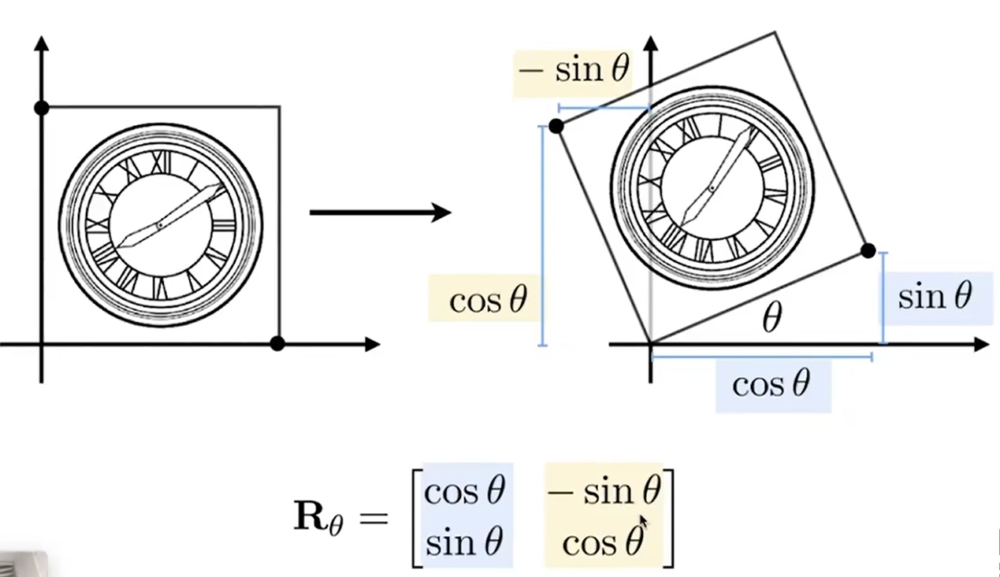

# GAMES101-现代图形学入门

[TOC]
## Lecture 1:Overview of Computer Graphics
### 1.什么是好的画面？
* 直观的标准就是看画面是否足够亮，体现的是渲染中的关键技术：全局光照，画面做的好，整个画面就会亮，看起来很舒服
### 2.VR/AR的区别
* 虚拟现实是看不到现实的，头戴式设备内看到的东西都是电脑生成的；增强现实，可以看到现实的环境，并会看到新的电脑生成的东西显示在画面里面
### 3.图形学≠计算机视觉
* 计算机视觉，一切需要进行猜测的内容，比如语义分割（分割出来哪些是人哪些是道路），目标检测（推理找出某个目标对象）希望计算机能以视觉的方式进行分析理解、推断推理。在本课程中不会涉及，不属于图形学的范畴
* 二者的结合越来越紧密，界限也越来越模糊

### 4.随记
#### The Quick Brown Fox Jumps Over The Lazy Dog
* 这句话里面包含了26个字母，所以常用于Typography的测试，会出现一遍大写一遍小写，可以测试一个字体的美感和完整性
#### Learn Graphics ，Not Graphics API

#### Geek
* Geek = Genius✔ + Freak❌
#### Tradeoff思想
* No Free Lunch，没有免费的午餐
* 在两个或多个竞争性或矛盾的选择之间进行权衡或取舍的行为，例如：时间复杂度vs空间复杂度
## Lecture 2:Review of Linear Algebra
### 0.阅读材料
* Tiger Book : 第2章Miscellaneous Math、第5章Linear Algebra
### 1.Vectors
#### 1.1基本概念
* 数学上叫向量、物理上叫矢量，含有两个重要的属性：方向和长度
* 向量平移到不同位置，依然是一个向量，因为向量间两点AB的相对位置并没有改变，并不关心向量的绝对开始位置
* 向量的长度：若长度为1，则称为单位向量。任一向量想要变为单位向量，用向量本身去除以其长度，就可以得到一个和原始向量同方向，且长度为1的一个单位向量

#### 1.2 Vector Addition
* 平行四边形法则：在几何上的表述方式，向量间尾部相接
* 三角形法则：在几何上的表述方式，向量间首尾相接
* 笛卡尔坐标：在代数上的表述方式
#### 1.3 Vector Multiplication
* Dot(scalar) product：点乘最后得到的是一个数  
	a、应用：1、可以通过点乘快速的得到两个向量间的夹角（计算光线入射的夹角、物体表面的法线、摄像机目视角度等）2、将一个向量投影到另一个向量上 3、通过点乘判断多个向量的方向相近或相离
  
* Cross(vector) product：叉乘得到的是一个向量
	a、向量的叉积并不满足交换律，若要交换顺序需要加个负号
	b、右手螺旋定则（right-handed）：bxa，则除大拇指外从b芳香手指并列卷向a，则此时大拇指指向的方向为叉积后的方向
	c、向量的叉乘可以表示成矩阵形式
  
	d、应用：1、判断左和右（叉乘得到的结果为正，则在左侧，若为负则在右侧） 2、判断内与外（叉乘的结果都在封闭图形各边的左边，则在该封闭图形的内部，否则在外部）
* Orthonormal bases and coordinate frames.
### 2.Matrices
#### 2.1基本概念
* 矩阵就是一组m行n列的数
* 矩阵相乘要遵循“第一个矩阵的列数等于第二个矩阵的行数”这个原则
#### 2.2 Matrix-Matrix Multiplication
* 矩阵的相乘依然不满足交换律
#### 2.3 Matrix-Vector Multiplication
* 将向量看作一个m * 1的矩阵
* 求一个向量关于y轴对称的镜像

#### 2.4 Transpose of a Matrix
* 两个矩阵乘积的转置 = 各自转置矩阵的乘积（次序颠倒AB->BA）
#### 2.5 Identity Matrix and Inverses
* 单位矩阵：对角线上为1，其他均为0的矩阵
* 逆矩阵：一个矩阵A如果和另一个矩阵B相乘得到单位矩阵，则矩阵B称为矩阵A的逆矩阵
* 两个矩阵的乘积的逆矩阵 = 各自逆矩阵的乘积（次序颠倒AB->BA）
#### 2.6 Vector multiplication in Matrix form
* 用矩阵的形式表示向量乘积

## Lecture 3:Transformation
### 0.名词解释
* Transformation：变换
* Modeling：模型变换
* Viewing：视图/观测变换
* Shear：切变
* Homogeneous coordinates：齐次坐标
### 1. 2D transformations
#### 1.1 Scale Transform（Uniform/Non-Uniform）
* sx，sy分别为x轴和y轴上的缩放的倍率，则其中由sx，sy和0组成的矩阵称之为缩放矩阵Scale Matrix

#### 1.2 Reflection Transform
* Reflection Matrix

#### 1.3 Shear Transform
* Shear Matrix

#### 1.4 Rotate Transform
* 讨论基准：不特殊说明默认绕零点（0，0）旋转，默认按逆时针方向旋转
* Rotate Matrix，如果是负角度，则旋转矩阵为该旋转矩阵的转置
* 从定义中可知，旋转θ角度和旋转-θ角度的旋转矩阵相乘为单位矩阵，则我们又可以发现，所以在旋转矩阵中，旋转矩阵的转置就等于旋转矩阵的逆矩阵
* 在数学上，如果某个矩阵的转置等于该矩阵的逆矩阵，则我们又称它为正交矩阵。所以旋转矩阵就是一种正交矩阵

* 推导过程

#### 1.5 Linear Transforms = Matrices
* 可见，线性变换都可以用矩阵的形式进行表达
* 前提：相同维度
### 2. Homogeneous coordinates
#### 2.1 Why Homogeneous coordinates

* 可以发现平移变换之后，无法直接的写为一个向量和矩阵相乘的形式了，可以在上面的2D变换的基础上通过和另一个向量的相加减实现描述。这也反映出来平移变换不是一个线性变换
* 但人类总是懒惰的，并不想把平移变换当作一个特殊的变换，是否有某种统一方式能将所有的变换包括进来？这就是齐次坐标
#### 2.2 Solution:Homogeneous coordinates

* 给二维向量或点增加第三维，使得平移操作能用一个矩阵乘以一个向量的方式进行表达
* 二维点增加第三维为1，二维坐标增加第三维为0（保护向量具有平移不变性）
* tradeoff的代价就是增加了维度进行存储额外的0 0 1
* 变换的执行顺序是先进行线性变换再进行平移
#### 2.3 Affine Transformations
* 放射变换 = 线性变换 + 平移，可以用齐次坐标表示如下，可见在二维变换的情况下最后一行永远为0, 0 ,1，最后一列永远为平移变换的距离tx，ty , 1

#### 2.4 Inverse Transform
* 逆变换：之前所作变换的逆矩阵
#### 2.5 Composite Transform
* 矩阵间乘操作的顺序不一样，出来的效果也会不一样，也反映出矩阵是不满足交换律的
* 矩阵的执行顺序：从右到左
* 但别忘了矩阵是有结合律的，可以先对矩阵进行计算，合成得到一个矩阵，再和点进行相乘
#### 2.6 Decomposing Complex Transform
* 一个复杂的变换可以分解为若干个简单的变换来实现，例如：先平移回原点再进行其他操作，完成后再从原点平移回出发点即可
### 3. 3D Transformations
* 同理，在三维坐标中也可以用齐次坐标的形式对点和向量进行升维，用4 * 4的矩阵进行仿射变换的表示，4 * 4矩阵的最后一行永远为0 ，0 ，0 ，1，最后一列永远为平移变换的距离tx，ty , tz ，1，左上角的3 * 3为三维空间中的线性变换过程
* 3 * 3的执行顺序是先进行线性变换，再进行平移，所以如果是点左乘一个线性变换矩阵，再左乘一个平移矩阵，是可以写在一起的
 
#### 3.1 Rotate Transform
* 三维空间的旋转先从简单的绕坐标轴进行旋转看起，例如在绕x轴进行旋转的时候，三维点的x值是不变的，y和z的值会进行改变，则只对y和z进行旋转，变成了一个二维空间上的旋转问题，所以第一行第一列为1，该行该列其余位置均为0.
* 同理，绕y轴旋转时，第二行第二列为1，该行该列其余位置均为0；绕z轴旋转时，第三行第三列为1，该行该列其余位置均为0
* 可见在绕y轴进行旋转时，区别于绕x轴和绕z轴旋转，sinα的正负号反了过来，是因为基于xyz的顺序，前两个向量叉乘能得到下一个，则向量y是由z向量叉乘x向量得到的，所以它的负号是反过来的
 
#### 3.2 3D Rotations
* 对于一般性旋转则可以转换为简单旋转的组合
* Euler angles：欧拉角，roll（翻滚角）、pitch（俯仰角）、yaw（旋转角）
 
* Rodrigues’ Rotation Formula：罗德里格斯旋转公式，n为旋转轴，α为旋转角度，沿着某一个轴旋转，默认过原点，将原点作为起点
 
* 对于复杂任意轴同样是进行分解
* quaternions四元数：计算旋转矩阵与旋转矩阵之间的差值，该课程不进行讲解及运用
## Lecture 4:Transformation Cont
### 0.名词解释
* Projection：投影
* Orthographic：正交
* Perspective：透视
### 1.Viewing Transformation
* MVP变换：model transformation -> view transformation -> projection transformation，模型->视图->投影
#### 1.1 View/Camera transformation
* 放置相机的三个要素：1、位置e 2、向上的朝向t 3、上下所看的角度g，这三个元素就构成了观测矩阵，向上的朝向可以理解为欧拉角中的roll翻滚角，（人拿着相机侧身弯腰，拍到的水平画面会倾斜）
 
* 当相机和所有的物体移动的速度、方向都相同时，即不产生相对运动的情况下，相机所拍出的照片是相同的
* 为了简化操作，人们就将相机固定放在原点（0，0，0）上，在y轴上永远向上看，在z轴上永远向-z的方向看，这个称为相机的标准位置
* 则将相机放置在标准位置上的过程在数学上可以表示为：（1）将位置e平移到原点上（2）将所看的角度g旋转到-Z（3）将向上的朝向t旋转到Y（4）将g叉乘t旋转到X
 
* 将上述操作用矩阵的方式表达，这里由于要先到原点，所以先做平移。但是正操作过程不太好写，如果是从原点出发做逆操作就好写了,也就是X->(g x t)，Y->t,Z->-g。又因为旋转矩阵是正交矩阵，所以直接对内部的3 * 3变换部分进行转置即可
 
#### 1.2 Projection transformation
* 正交投影更多用于工程制图，不会带来近大远小的现象；人眼的成像会更接近透视投影，看到的平行线不平行会相交到某个地方去，一叶障目，经典图片“鸽子那么大”
 
* 透视投影，认为摄像机放在某一个位置上作为一个点，点与画面连出空间上的一个四棱锥，四棱锥中某一个深度到另一个深度之间的区域称之为frustum（视锥体），把这块区域中的所有东西显示在近处平面上
* 正交投影，则认为将相机拿到足够远的位置，则此时发现近处和远处的平面一样的大小，无论物体有多远，投影到平面上的东西都是一样的
##### 1.2.1 Orthographic projection
* 具体的做法：（1）将相机放到标准位置（2）然后把Z轴丢掉，此时所有的东西都在xoy平面上了（3）最后不管xy的范围多大，都缩到[-1,1]之间（约定俗成，方便后续的计算），就得到了正交投影的结果，此时物体在里面会被拉伸，后续还要做一个视口变换，后续会提及
* 更正式的说法：不管空间上多少长宽高的长方体，都可以正则成一个标准的立方体，做法：先平移到原点，再缩放
 
* 注意在z轴上，实际上是越远的值比越近的值越小
* Transformation Matrix：其中平移部分（r+l）/2为x轴上左和右的中心，负号是因为要把一个点往原点方向移动，无论是正负数都是负号，其他的类似；缩放部分中2/（r-l）做的是缩放操作，2是因为-1到1的距离为2，其他的类似
 
* 网上看到的结果和这里不一样是正常的，可能是使用的坐标系不同，比如OpenGL使用的左手系
##### 1.2.2 Perspective projection
* 透视投影，使用最广泛，近大远小。
* 实现透视投影的过程可以理解为，（1）将远端平面上的四个点往近平面上面挤，将frustum视棱锥挤成一个长方体（2）再做一次正交投影
* 上文已经知道了第二步正交投影怎么做了，那么第一步“挤”的过程怎么做，首先先规定几个规则，（1）近平面的位置永远不变，该平面下任何一个点都不会变（2）远处的平面，在经过挤压后，z值（即深度）依然不变（3）远平面最中心的点，在经过挤压后，其位置仍然在最中心（0，0，f）三个轴的值都不变
 
* 从透视->正交的矩阵M[persp->ortho]求解过程如下所示，
	a、左边的zoy是相机拜放的位置，根据相似三角形原理
	 
	b、
	c、
* 最后再做一个正交投影即可
* 思考：对于中间的某一个点，经过挤压的点，它的z是会变小还是变大？
## Lecture 5:Rasterization 1 (Triangles)
### 0.名词解释
* Rasterization：光栅化，三维空间的几何形体显示在平面上就叫做光栅化，实时图形学中会广泛的应用到
* 实时图形学：当一秒钟能生成30张画面，也就是fps达到30，否则称为offline离线图形学
## Lecture 6:Rasterization 2
## Lecture 7:Shading 1
## Lecture 8:Shading 2
## Lecture 9:Shading 3
## Lecture 10:Geometry 1 (Introduction)
## Lecture 11:Geometry 2
## Lecture 12:Geometry 3
## Lecture 13:Ray Tracing 1
### 0.名词解释
* Ray Tracing：光线追踪
## Lecture 14:Ray Tracing 2
## Lecture 15:Ray Tracing 3
## Lecture 16:Ray Tracing 4
## Lecture 17:Materials and Appearances
## Lecture 18:Advanced Topics in Rendering
## Lecture 19:Cameras,Lenses and Light Fields
