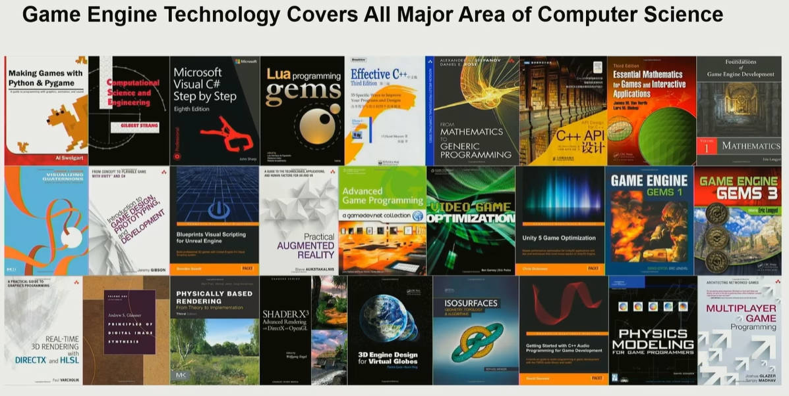
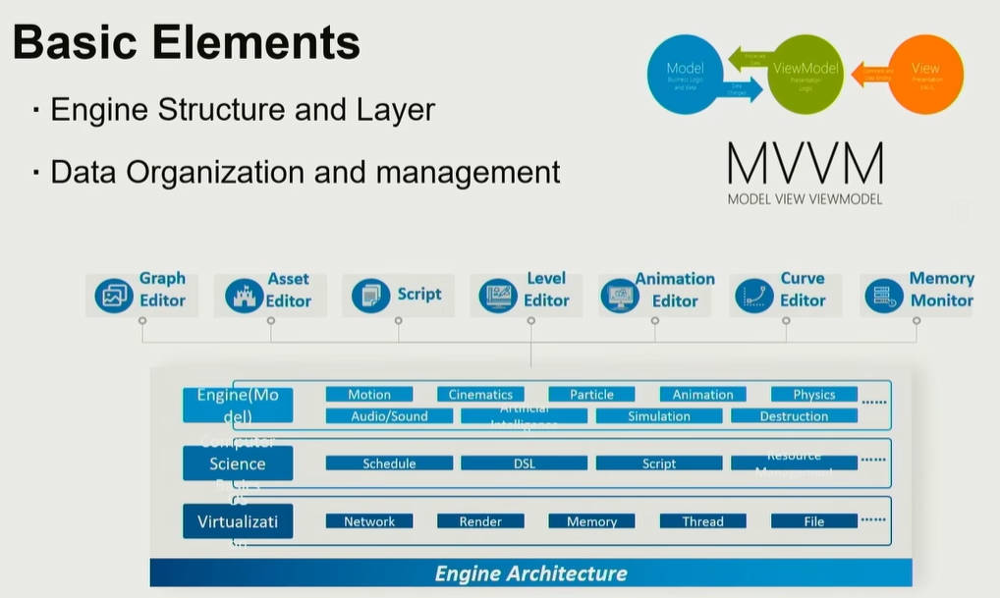
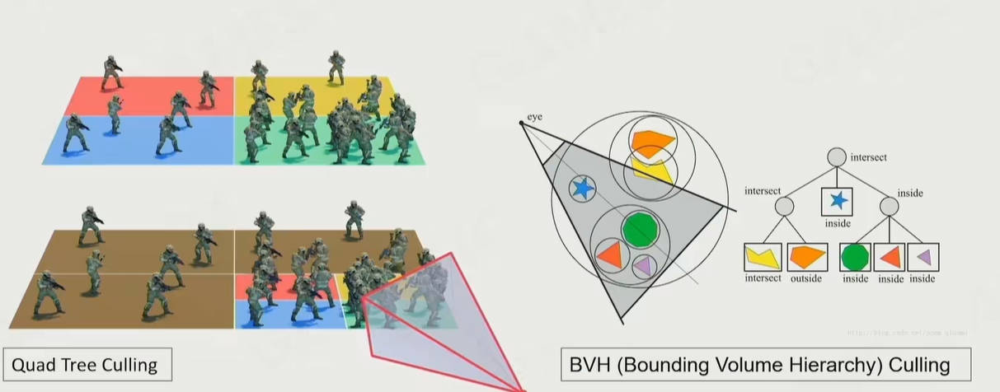

# GAMES104-现代游戏引擎：从入门到实践

[TOC]
## Lecture 1 : Modern Game Engine - From Getting Started To Practice
* Father of Engine : John Carmack,1992年创造开创FPS的游戏Wolfenstein 3D，在游戏Doom中将可通用的代码集合成引擎，全家的第一个游戏引擎。后续创造3D射击对战游戏Quake，游戏引擎中引入了研究联网对战下网络如何运行
* 游戏引擎的发展和硬件的发展离不开，随着算力的强大，系统的复杂度也在增大，早期的游戏引擎十分简单，现在的引擎有上百万行代码
* Zoo of Game Engines

* Middlewares：中间件，专门完成引擎中物理、声音、渲染部分功能的组件，中间件公司的寿命一般不长，常常被引擎公司收购

### 0. 名词解释
* Tool Set：工具链
* Misc System：特效系统
* Motion Matching：动作匹配
* Procedural Content Generation(PCG) ： 生产内容生成
* Data-Oriented Programming(DOP)：面向数据编程
* Entity Component System（ECS）：实体组件系统
* Job System：任务系统
* Lumen：UE中的全局光照
* Nanite：UE中的面片几何细节
### 1. What is Game Engine
* Technology Foundation of Matrix : 黑客帝国的技术基底
* Productivity Tools of Creation ： 创造工具
* Art of Complexity ：复杂的艺术，不存在一个完美的引擎，都是不同的tradeoff
* 本质上是不同状态下的0/1变换，只要有无限长的纸带上进行打点，就能实现不同的状态，这就是图灵机
* 做引擎要先学会做工具，工具的用户不是玩家，而是艺术家和设计师，为了方便二次开发，程序员也是工具的用户，引擎本质上是可协作的生产力工具
* 当引擎进行升级的时候，原本能运行的程序还要能正常运行
### 2. How to Study
* 本课程的目的是先把框架搭好，不要陷入具体的技术点。学完之后能知道打开一段游戏引擎的源码，要先看的是哪部分（答：实现Update功能的函数，可以顺藤摸瓜找到所有的状态改变），课程还涉及到Rending、Animation、Physics、GamePlay、Misc System、Tool Set、Online Gaming、Advanced Technology等部分的知识

* Course Website：https://games104.boomingtech.com/sc/
* Renferences：《Game Engine Architecture》- Jason Gergory
* Mini Engine

### 3. Q&A
* Q:可视化编程是否是未来发展方向？
* A:创意和想象力是民主的，不应被编程所限制，一个孩子眼中的世界可能很精彩，引擎则是一个实现创意的工具，所以蓝图是一个未来发展方向

## Lecture 2 : Layered Architecture of Game Engine
### 0. 名词解释
* Pilot : 领航员
### 1. A Glance of Game Engine Layers
* Tool Layer ：工具层，引擎的最高层，集合各种编辑器Chain of Editors
* Function Layer : 功能层，让游戏世界可见，可动，可交互

* Resource Layer : 源数据层/资源层，加载和管理Data and Files
* Core Layer : 核心层，上面的各层会频繁的调用的底层代码，实现对进程线程、内存的调用及管理

* Platform Layer : 平台层，不同的用户使用的硬件平台，不同的软件发布平台（Steam/EPIC），实现I/O的设备不同，平台层实现不同输入设备到游戏内的翻译，处理各种各样的平台

* 以及包含很多Middleware 和 3rd Party Libraries，第三方代码及中间件贯穿五个层次
### 2. Practice is the Bset Way to Learn
* 从一个可动角色的构建例子来理解整个引擎架构
#### 2.1 Resource - How to Access My Data
* 已知得到一个构建好的角色模型，数据的格式不一样，在引擎中无法一一直接打开，需要转换为一个引擎能处理的公共格式，转换玩后就变成了assets资产（*.ast）
* 从resource到asset的不同是：不同的格式比如png，里面有压缩算法，GPU不好绘制，在importing后，引擎会转化为dts格式，将文件的编辑数据给丢掉，只保留必要的部分，按照16bit将元素排列好，可以直接丢进显卡加入到显存中，从而实现纹理。所以游戏引擎的一个重要功能是将不同的数据、资产等实现关联
* GUID：每个资产的全局唯一识别号（每个人的身份证号），只要识别号还记录，无论位置如何移动都能找到

* 对于资产还需要实时的资产管理器Resource Manager，对资产进行管理，管理所有资产的生命周期，常常在资源管理层中，常见的有Handle系统，涉及到Garbage collection（GC）垃圾回收，若垃圾回收做的不好会在资产出现变换时出现卡顿

#### 2.2 Function - How to Make the World Alive

* Tick：两大神兽tickLogic，tickRender，先对游戏逻辑进行处理，然后对逻辑处理的结果进行渲染
* 人是依靠视觉残留去感知一个世界的
* Heavy-duty Hotchpotch：功能层集成了很多复杂的实现
* Multi-Threading：最理想的状态就是JOB System，但系统之间存在相互依赖dependence，实现存在难度，在设计的适合应该从多核的角度进行思考

#### 2.3 Core - Math Library

* Core是引擎的核心层，不轻易进行改动
* 游戏引擎对于效率十分关注，所以数学库的效率十分重要，大多数时候不追求计算的数值绝对正确，大致正确即可
* Data Structure and Containers ： C++的库里面已经实现了一遍，在引擎中还要重新实现一遍，因为在引擎中高频的增删数据会在内存中产生大量的内存碎片，比如C++的vector在缺空间时，会直接申请两倍的空间，这就需要进行响应的内存管理
* Memory Management：对于内存的访问进行优化，连续存储等
#### 2.4 Platform - Target on Different Platform
* 平台层无视平台之间的区别，将平台之间的差异度进行掩盖
* RHI：Render Hardware Interface , 重新定义一层Graphics API，将不同库进行封装，同样的软件不同的版本实现的逻辑也不同，比如DirectX 11 和DirectX 12

* 不同的硬件平台甚至CPU架构都不一样，PS3中存在几个协助的CPU称为SPU协处理器，可以协助进行运算实现优化，但对于平台层的实现增加了复杂度
#### 2.5 Tool - Allow Anyone to Create Game
* 工具层，提供一系列的编辑器让功能实现更丰富以及降低使用门槛，创造力的实现平台，注重运行效率和开发效率的平衡，代码的维护复杂度高

* Digital Content Creation（DCC）：数字内容生成，asset Conditioning pipeline，针对不同软件的各种各样的资产导入导出器，需要一个统一的数据交换格式提高效率，连接完整的生态环境
### 3. Why Layered Architecture?
* 解耦以降低复杂度、解决复杂的问题
* 上层的代码变更的很快，底层的代码在checkin后稳定后不再变动，一般只允许上层次调用下层次的功能
### 4. Mini Engine - Pilot
* Basic Editing and Simple Funcitons

### 5. Q&A
* C++ 17引入了EA公司开发的EA-STL在内存的管理上实现了更高效的运用

## Lecture 3 : How to Build a Game World
### 0. 名词解释
### 1. Everything is a Game Objects
* Game Objects(GO) : 划分静态物、动态物、环境（天气、植被等）
#### 1.1 How to Describe a Game Object?
* Shape(Property)、Position（Property）、Move(Behaviour)、Capability of battery(Property)、Etc
* 游戏中的所有物体大致上可以分为属性Property和行为Behaviour两种

* 然而对于不同的物体，其可能存在多种特性，派生特别复杂，此时就提出了组件化Component Base

* Game object could be described in the component-based way
* Component-based Tick: 反直觉的一点是每个物体的更新不是以object为单位的，而是以组件为单位的，即所有人先更新头的位置，再更新脚的位置。理由是模拟的流水线，对相同的组件进行批处理，提高读写效率，同时并行实现流水线

#### 1.2 How to Explode an Ammo in a Game?
* Events：事件机制，发送消息告诉目标物体进行状态的调整，需要建立可扩展的消息系统
* Scene Management：类似八叉树的方法进行场景的管理实现快速的查询

### 3. Q&A
* Q:一个Tick过长怎么办
* A:延迟补偿、优化Tick、分批处理
* Q:Tick时候logic线程和render线程怎么同步？
* A:Tick logic会先于render，一般会分为两个线程
* Q:Component模式的缺点？
* A:单个物体情况下对于编写效率较低，于此同时，组件之间也需要通讯接口机制

## Lecture 4 : Rendering on Game Engine
### 0. 名词解释
* Visibility Culling: 可见性裁剪
### 1. Rendering System in Games

#### 1.1 Challengs on Game Rendering
* 游戏中需要渲染的物体过于复杂与繁杂
* 运行算法的设备并不是在最理想的设备上，需要深度适配当代的硬件
* 帧率需要追求稳定，画面的要求在提高，与玩家的游戏体验十分相关
* 渲染对于CPU并不能像GPU一样完全占用计算资源，需要将计算资源留于计算逻辑等
### 2. Basics of Game Rendering
* Computation - Shading

* Computation - Texture Sampling
#### 2.1 GPU
* SIMT：如果一个计算内核很小，但能做很多个，那么就可以在很多个核上做同一条指令，效能就变高了，在做运算的时候，尽量用同样的代码一起跑，速度会提高

* GPU Architecture：看着乱，但都是重复，内核划分为一组一组的称为GPC图像处理集群，一个GPC中有很多Steaming Multiprocessor

* Data Flow from CPU to GPU：冯诺依曼机将计算和存储进行分开，但数据的流动是有成本的。
* CPU拿了数据给GPU运算后再传给CPU，这个过程可能产生逻辑和渲染的延迟，导致出现秒级别的延迟，所以在游戏引擎架构中一个原则是，尽可能让数据单向传输，CPU送到GPU就结束，尽可能不从GPU中读数据
* GPU Bounds and Performance

* Other SOTA

#### 2.2 Renderable
* Vertex and Index Buffer：顶点是被不同的三角形共用的

* Why We Need Per-Vertex Normal?每个三角形可以算出朝向，几个三角形可以平均算出共用顶点的朝向，然而当物体表面出现硬表面的时候，两个顶点不一样却会出现相同的法线向量，所以需要为每个点单独定义法线向量

* Variety of Shaders：着色器的代码也是renderable的一种数据
#### 2.3 Render Objects in Engine
* Instance : Use Handle to Reuse Resoueces，对数据定义一次然后创建多个相同的实例

* Sort by Material：对材质进行排序，聚集同样的subMesh，提高GPU的渲染速度
#### 2.4 Visibility Culling
* Culling One Object：判断物体是否在视界锥里面

* 结合BVH进行查询，判断是否在视界锥中可见，从而降低渲染的复杂度

* Potential Visibility Set：PVS，将空间进行划分成不同的方块，通过固定的门窗最多只能看到有限的固定几个物体，此时只渲染那几个物体即可

#### 2.5 GPU Culling
* 先计算出场景的深度图，被遮挡在后面的物体不进行渲染
#### 2.6 Texture Compression
* 纹理通常会进行压缩，但不能用特别好的压缩算法，因为不支持随机访问
* Block Compression算法压缩思想：分成4 * 4，计算相邻像素的关联性，压缩和解压缩效率都很高
#### 2.7 Authoring Tools of Modeling
* Polymodeling : MAX / MAYA / BLENDER
* Sculpting : Z-Brush
* Scanning
* Procedural Modeling : Houdini , 自动生成存在某种规则的网格

#### 2.8 Cluster-Based Mesh Pipeline
* 将模型的表面换成很多个小的面片进行计算

## Lecture 5 :

