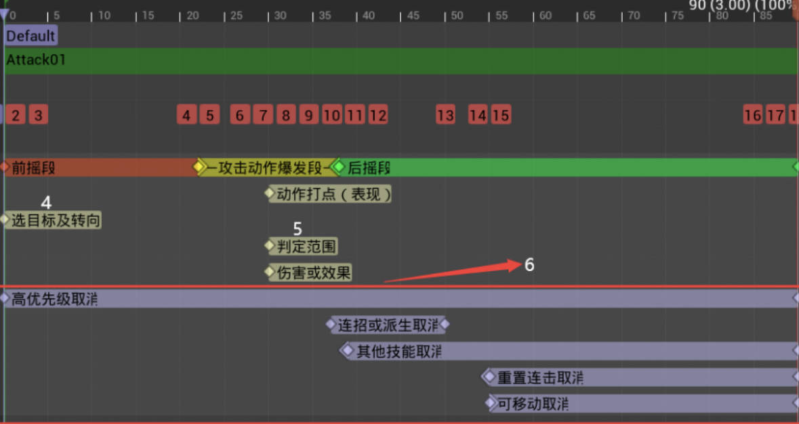

# GameMaker Plan
[TOC]
## 1.TD
### 1.x Prototype制作
#### 1.x.1 角色基础操作
* 移动速度
  * 角色的基础移动速度是一个很重要的数据，很多情况下与关卡或战斗玩法相关，你可能需要根据速度去计算玩家的移动能力来推算出合理的技能动作前摇及打击范围，亦或是根据角色的移动能力来推算关卡中两点之间的距离是否合理，地图的大小是否合理，不同角色身高不同移动速度不同是否需要平衡，如何平衡等等。
* 行走
  * 其实行走在大多数游戏中不是常用的移动行为，甚至去掉行走依然不影响游戏体验，它存在的意义更多的是更好地展示角色
* 奔跑
  * 奔跑状态的Pose与Idle会有一定区分度
* 加速跑
  * 加速跑状态的Pose与Idle相差很多，通常是游戏中角色的最快常规移动速度
  * 游戏中的处理手法多见为不从Idle直接进入加速跑，而是通过奔跑后的操作或者通过冲刺之后进入这个状态，这样也更加符合从静止→加速→加速跑的感受
* 停止
  * 在现实世界中我们以**正常速度奔跑**要停下来都会借势往前走两步，有的项目过度执着于这种仿真的手感做出来后，操作手感却很糟糕，惯性虽然符合常识但是在游戏中一定要慎用
  * 通常游戏中**最具速度感的加速跑**如果直接停住手感就会比较奇怪了，在加速跑急刹车时应配有相应的动作表现与实际位移，急停的位移过程要干净利落，尽量短暂，比如尼尔和原神的急停从开始减速到刹住车的Pose时间长度均在9帧左右，可以以这个标准为参考来调整手感。
    * 急停的表现效果主要目的是为了让玩家体会到冲刺的速度感，但并不该因此卡玩家手感，在松开方向键进入急停后，如果玩家立即重新进行移动输入或技能输入应进行即时反馈，玩家一定不希望在怪物前急刹车时无法移动和攻击被动罚站。所以急停的位移过程可以被移动或技能取消
    * 急停动作符合角色性格效果更佳【加分项】
* 转向
  * 对于角色的转向如果不做处理，当输入一个方向之后角色模型就会立刻瞬切，观感上造成不流畅的感觉。因此我们需要对转向的速度进行一定的限制处理，但是这个转向速度在接受的表现范围内一定要尽可能大一些，这样可以让我们的反馈更及时操作手感更加流畅
    * 对于速度较快，上半身动作幅度较大的奔跑动作，在转向时可以使用朝对应方向倾斜的衔接动作或Pose进行处理使之表现更加合理。
    * 如果动作整体节奏较快，可以加入更为夸张的类似现实中折返跑的刹车动作表现，让整体动作更符合物理规律
  * 当角色朝当前面朝向的相反方向移动时（尤其是快速移动），可以增加对于急转身情况的特殊处理提升表现效果。可以直接通过衔接动作或融合转向Pose完成转身
* 快速位移类（冲刺/闪避/翻滚等）
  * 冲刺闪避或者翻滚是常见的Timing考核点，在正确的时机躲过敌人的攻击更高效率的进行战斗是大多数动作向游戏的内核之一。虽然主要是为战斗服务的，但由于不太涉及到打击方面的内容所以把这部分归类到了基础移动中。
  * 翻滚的过程感明显，更容易把偏慢的节奏表现得合理，翻滚出去的过程及时间可以更好的调整，同时角色需要起身后进行移动，可以根据这些时间的调整来控制操作有一定的行为选择代价，因此节奏偏慢，技巧更硬核的游戏大多采用此种方式
  * 但如果我们不想强调玩家需要对此行为进行付出代价和学习成本，想要玩家可以更加即时的进行快速位移并且可以无缝进入移动状态来调整走位，则更推荐使用快速发力冲刺的动作表现形式
* 左右脚处理
  * 不论是走、奔跑、加速跑还是冲刺急停等等，过程中都会涉及到哪只脚在前哪只脚在后的问题。例如如果目前只有一个奔跑停止的动作，同样的融合时间，如果不区分左右脚表现，那么只有确定的一只脚在前的时候表现是流畅的
  * 介绍一个在UE引擎中较为简单的实现方式：我们以奔跑接停止为例，在奔跑循环动画序列中观察角色动作来标记通知修改一个变量，例如当左脚在前（或空中）时变量为0，右脚在前（或空中）时变量为1，在动画循环时就会根据当前动作情况修改这个变量的值
#### 1.x.2 技能释放
* 技能的时间轴构成
	 
	* 前摇段：把技能释放生效那一刻之前的动作称之为动作的前摇段
	  * 起手后的蓄势准备出手阶段需根据攻击时的重量感、力度综合考量来决定其动作长短是否合理。比如大剑和锤等重武器的蓄势准备阶段就应当考虑在不拖手感的情况下稍微慢一些；而单手剑或双刀这种快节奏武器这个过程就会很快，甚至两三帧之后直接进入挥砍（攻击动作爆发段）。 
	* 动作爆发段：
	  * 攻击动作爆发段为去掉所有前后多余的动作后，中间最为干净利落表达攻击的一段动作，直接表达角色攻击行为的一小段动作，伤害或其他效果的判定点通常也在这段动作中施加给目标。
	  * 技能判定点需要在某一帧施加给目标，动作上对应的Pose本文称之为动作打点，逻辑和表现在时间轴上要严格吻合才能符合玩家的直觉，来保证手感
	  * 如果是非攻击类技能，比如是给自己上一个增益buff，则可以直接使用动作Pose最强的一点作为判定点，比如抬手握拳或是打响指的那一帧。另外，一些特殊的攻击动作，比如拿锤子砸地触发伤害，可以找砸地的那一帧作为动作打点。
	* 后摇段：攻击动作爆发段结束后，对于地面释放的技能，角色接下来需要回到站立Pose，这个动作过程我们称之为后摇段，它是美术表现力外显的关键环节，重点就体现一个字“飒”
	  * 攻击动作爆发段结束的Pose可以在后摇时定几帧
	  * 收回的时候尽量把动作做慢
	  * 想把细节体现得更好就花更多工作量把后摇收招的动作以各种符合角色性格的形式丰富起来
	  * 后摇段时长远远长于前摇和攻击动作爆发段的时间，因为动作的后摇可以被各种行为取消，我们不用担心它会拖慢战斗节奏，完全可以让角色唱跳Rap篮球之后再回到站立（前提是动作同学没意见）。动作的后摇往往能更好的表现前面攻击力度感的回收，快慢结合且张弛有序，同时也可以更好地体现角色性格和设定 	
	* 技能的起手不必要严格以Idle动作为起始帧，因为动作游戏中，各种情况下你都会使用普攻或技能，也就意味着它们肯定是要通过融合混入处理的，因此只要首帧动作与可能衔接此技能的动作相差不大，再配合上合适的融合时间即可满足表现上的要求
	* 辅助选择目标及转向（时间轴中白色序号4）
	  * 通常选目标的时序会在播放蒙太奇前释放技能时选取完毕，但此处一并标记在时间轴中。这两个功能搭配使用主要用于帮助玩家智能地选择想要攻击的目标（技能按下时选取目标），并自动转向（通常在技能动作的第一帧完成转身）对其发动攻击
	* 攻击判定及产生效果（时间轴中白色序号5）
	  * 攻击判定的方式并不固定，例如可以是武器射线或者碰撞盒检测重叠，或者是通过判定盒子先筛选目标之后对这些目标附加伤害或技能效果。第一种方案局限性比较大，在强调联网的游戏中很少使用。
	* 可取消段（时间轴中白色序号6）
	  * 高优先级取消：通常应用于游戏中的特殊定位的技能，例如你希望角色的大招可以在其他技能释放的过程中的任意时间点都可以最高优先级释放出来，或者你希望游戏中的冲刺或翻滚可以在其他攻击技能过程中更灵活地调整走位，那他们的可取消时间点都应在其他技能时间轴中比较靠前甚至第一帧的位置。
	    * 对于有CD或消耗的技能，根据具体情况可以考虑让技能效果完成后高优先级取消才能生效，或者是如果技能前摇可以被高优先级取消，但可以返还一定的CD和消耗
	  * 连招或派生取消：通常应用于相对确定的连招（普攻连段或其他派生技能）表现中，此类技能的特点是其在出招过程中的一小段窗口期内（从动作表现上来说就是与衔接技能首帧动作一致或相近的几帧内），可以通过按键触发下一段攻击。
	  * 其他技能取消：对于游戏中的非固定连招间的衔接，为保证动作表现及手感顺畅，通常取消时间点在攻击Pose帧附近。之前提到过动作的节奏，攻击动作爆发段往往会较快不拖沓，如果其他技能取消的时间点较早，则会让整体衔接感觉过于急促，还未完全发力完成就进入了其他技能攻击；但若取消时间点较晚，则会让玩家觉得卡手感。
	    * 对于一次攻击来说最具标志的动作应该是其挥砍完成时的Pose，一定要结合这个Pose给取消的时间点。即便是动作的节奏非常快的游戏中，其出招过程也许快到难以看清，但在释放技能时最具表现张力的关键Pose也要做到可以清晰分辨。这个Pose也是美术同学在制作过程中最精心打磨的，必须要很好地展示出来才行。和打篮球一个道理，进不进球无所谓，只要出手姿势够帅就能带来极大的观赏度。
	  * 可移动取消：可移动取消通常是时间轴中最靠后的一段（也经常会被叫做自由取消段），这可以使技能从一定时间开始可以自由地被移动跳跃等任意行为取消。你也可以理解为从这个时间点之后，技能的逻辑已经完全结束，状态机回到了Idle，只是剩余的后摇动画还在播放，仅此而已
#### 1.x.3 输入及手感
* 输入检测
	* 无论是键鼠、移动端还是手柄，按键本身的基础状态只有按下和抬起两个状态，所有以按键形式触发的技能都由按下抬起两个基础状态判定来实现的。例如：常规的技能是由按键的按下输入触发释放；蓄力类技能是由按下输入触发蓄力阶段，并由抬起输入结束蓄力，若未检测到抬起输入则在一定时间后自动释放或自动取消；引导类技能是按下输入触发进入特殊状态并持续一段时间后自动结束，若检测到抬起输入提前结束引导状态。 
	* 在不存在长按短按的问题时，所有技能的输入检测都可以使用按下输入触发。但若需要区分长按与短按时，为区分二者，短按可以以抬起输入作为判定，长按则以按下一定时间进行判定。	
* 输入缓存：预输入
	* 预输入指的是在一个动作将要结束前（例如一个技能释放过程中，或者受控制状态不能操作时），允许提前输入下一个动作指令的机制
	* 预输入成功的话，则动作间无缝衔接，可以最快速做出下一个行动，在搓招操作复杂或者网络延迟不稳定的情况下，这一机制对于战斗表现和手感尤为重要。偏动作表现的游戏中，如果希望有顺畅的操作和丝滑的动作衔接，肯定绕不过这个功能
	* 预输入的大前提是：预输入阶段输入再多指令，最终只有一个指令对应的动作生效
	* 预输入考虑的问题
	  * 哪些操作在预输入的记录范围内【移动的轴向输入通常是不计入到预输入中的，对于游戏中其他各种行为，例如跳跃，吃药，抓扔物品，使用技能等等需根据实际情况加入到预输入的缓冲存储中】
	  * 普通按下与长按的区分处理【预输入中也需要区分短按和长按的操作。此处对应不同操作可以设置不同的预输入时长。】

#### 1.x.4 操作手感相关的功能
##### 1.x.4.1 辅助选择目标
* 如果所有技能都是只能往角色面朝向方向释放，那么从操作难度上来说直接拉满，会非常影响手感，所以通常游戏中会采用辅助目标选择或者锁定的方式来解决这个问题，核心出发点在于帮玩家选择一个他此时此刻最有可能想攻击的目标，需要从以下几个关键参数考虑：
	*  技能选取目标的距离范围
	*  优先选取的角度范围
	*  角色面朝向及摇杆（方向键）输入方向
* 无论智能选目标的方案怎么完善，可能都并不能满足所有玩家的操作习惯，故建议开放配置项可以让玩家自己选择自己想要的方式，例如：
	*  仅距离优先
	*  仅朝向优先
	*  朝向及摇杆方向优先
	*  摄像机朝向优先（带准心的远程武器使用这种选目标方式会更合理）
##### 1.x.4.2 锁定模式
* 这个功能并非必需，因为它会带来一定的使用操作成本，需要根据项目情况权衡是否增加此功能，锁定模式的应用可以更好的观察具体某一个敌人的行为，同时使技能释放的目标确定下来，由于这是一个在动作向游戏中很常见的功能
* 锁定模式下角色的移动方式，常见的处理方式主要有以下两种：
	*  方式一：角色始终朝向目标，采取八方向移动的方式进行移动
	*  方式二：不改变角色的基础移动形式
	*  如果项目中大多数情景都是针对较少敌对目标的情况，且整体动作节奏偏慢，对于敌人的动作关注度要求较高，则可以使用方式一。但如果是偏快节奏的战斗且经常会出现被一波怪包围的情况，则可以使用方式二。
##### 1.x.4.3 转向
基础移动中的转向是为了朝某个方向移动，而战斗中的转向就是为了朝某个方向攻击来更好地命中目标，从转向的时机来划分主要分为瞬间的转向以及可持续的转向
* 瞬间转向：在没有攻击目标时，每一段普攻在释放时都会在最开始根据你的摇杆输入方向瞬间转过去，如果有目标的情况下可以根据辅助选择目标的方式对当前最优先的目标进行转向，有些蓄力时间较长的技能，可以在蓄力后的攻击前再增加一段转向避免目标移动偏出了技能开始释放时的朝向的问题
	* 虽然说是瞬间转向，但实践证明只要攻击动作不是完全下盘不动的情况，不需要担心转向过程过快造成表现不合理的问题。
* 可持续转向
	*  转向可以是一直朝向目标的转向，也可以是玩家输入的朝向，例如，冲锋既可以是朝目标冲锋，时刻根据目标的方向来修正自己的位移方向；也可以是根据玩家手动操控角色往哪个方向进行冲锋。具体使用哪种可视技能设计而定。
* 一些处理
	* 对于非移动中释放的技能处理起来可能会比较棘手，例如一个原地蓄力的技能，由于蓄力期间的Pose是偏静止的，脚步也不会有什么动作，此时处理起来可以有两种方案：
		* 第一种，不好解决的问题就藏一藏，可以利用摄像机的视角变化把腿部挡起来
		* 第二种，可以在转向时加入下半身动作，从动作上配合角色的转向行为
		* 当然你也可以选择不处理，因为相比技能本身的特性，这里的处理是个优先级比较低的锦上添花的部分，感觉玩家对这方面的感知也比较弱，很少有人抓着这一点喷  
##### 1.x.4.4 追身吸附攻击
为了减小操作难度，对于攻击范围较小的近战武器，为避免角色走到怪物较近距离时攻击但怪物却刚好在伤害范围之外的尴尬情况出现，可以在攻击时（通常为普攻第一段）自动追加一个迈步冲向目标，对其进行追身吸附攻击。这里列举两个不同的实现方案。
* 第一种方案适合追身吸附距离不远的情形使用，只用一个攻击动作就可以实现功能，但要求动作自带跨步，原神中单手剑角色的普攻就是按这种方式处理的，当一定距离内没有找到目标或目标距离较近时则只用动作自带的rootmotion向前进行挥砍，但若有目标且距离较远则会向前位移至目标身前一定距离完成攻击。
* 第二种方案适合追身吸附距离较远的情形使用，由于位移距离较远无法使用统一的动作兼容。与第一种方案一致也是通过距离判定，当一定距离内没找到目标或目标距离较近时使用原地向前的挥砍动作，但若有目标且距离较远则使用向前冲刺攻击的动作进行攻击。由于也是不定长位移且位移距离区间较大，冲刺的过程要尽量快，且为了表现顺滑最好和挥砍动作尽量融为一体，即冲的过程中就进行一定的攻击前摇动作，到位后片刻进入到动作打点
##### 1.x.4.5 惯性倒步攻击 
* 如果项目中决定弓箭的普攻为有节奏的连击（而非准心瞄准，八方向移动射击的形式），建议使用原神这种一边射一边向后退的动作表现，一是可以体现射击的力度和节奏，把射击动作多样化，二是可以避免站桩输入的形式，提升动作的表现力从而间接提升普攻的射击手感。【不错的建议】
##### 1.x.4.6 蓄力类技能
* 动作：蓄力过程中为体现整个招式的力量感，出手时更要注意做到上面提到的攻击爆发节奏，从蓄力Pose的偏静止状态衔接到打出攻击的释放动作，才可以更好的体现由静到动的变化，蓄力过程中最特殊的时间点是刚好蓄满的那一瞬间，玩家在此时接受到足够强的提示后释放技能才会有更好的反馈感，这一点动作上可以配合做出提示，例如轻微幅度的抖肩或抖手腕。
* 特效：由于在蓄力过程中的动作通常是偏静止的，此时可以用特效来表示蓄力的过程，与玩家的长按操作呼应，在蓄力满时特效也可以做加强提示处理
* 音效：在蓄力过程中通常可以用逐渐频率升高的音效代表蓄力过程中的力量或能量逐渐变强，来反馈玩家的长按操作
* 摄像机效果：蓄力时也可以使用摄像机推进或拉远，并在蓄满时有一定晃动感来表示完成蓄力，再释放时配合攻击爆发段快速将摄像机拉回到原有距离，可以更突出动作本身的力量感
* UI效果：蓄力条，蓄满时UI本身会有特效效果，但其实蓄力条本身我认为是与动作游戏的本质冲突的，它更适合作为一种动作特效等直觉本身无法很好传达的情况下的一种候补方案，可能会比较出戏。
* 输入手柄震动：如果你的项目是可以使用手柄操作的，在蓄力时给予马达由小到大的震动，在蓄满时给予一个短暂且更强的震动，只要别用力过猛，这绝对是一个非常好地提升蓄力技能释放手感的方式，因为这可以给到玩家在键鼠或移动端操作模式下无法体验的触觉反馈
##### 1.x.4.3 转向

### 1.x Editor Utility Widgets
### 1.x Camera的操作
* 摄像机和角色的关系
  * 角色位置根据参数决定摄像机位置，但摄像机的朝向（即摄像机与角色所呈的方位角度）决定玩家移动操作的基础朝向
  * 把摄像机理解为绑在角色身上的弹簧另一端的物体，在角色移动过程中摄像机要怎么合理地运动就很容易想象出来了：为了体现角色的速度感，当角色移动时弹簧应该被拉伸或压缩（取决于角色向摄像机朝向还是反向移动）一段长度
  * 当玩家在朝左右移动时，也可以使用这种手段处理，但不同的移动方向对于“弹簧”的拉伸效果可以不同，前后效果最明显，其他方向可以根据实际表现情况减小一定程度
  * 角色在原地跳跃时，由于与摄像机的绑定关系，摄像机会跟随角色运动，但由于角色跳跃在下落后逻辑上速度瞬间归0，如果摄像机不做处理会有一种快速运动骤停的感觉，其实很多游戏对这里是没有特殊处理的，但如果追求表现更好，可以在下落过程中让摄像机提前减速，这样角色落地后摄像机会有一个缓冲，不会从一定下降速度直接到停止
    * 可以对于跳跃的摄像机处理不仅做了高度上的缓冲，对于摄像机的Pitch参数也做了处理，跳跃时有细微变化，并在下落前缓冲回正直至原Pitch值。
* 位置相关参数
  * 当与角色绑定后，摄像机的位置可以被基于角色信息的空间向量确定（XYZ轴方向及距离）。大多数3D第三人称游戏中玩家可以操作来改变这几个参数，实现从不同位置看向角色。
* 俯仰角相关参数
  * 以摄像机看向角色的角度为基础，摄像机可有附加的角度偏移（Yaw Pitch Roll），由于在基础移动中需要确保摄像机看向角色，故这一组参数在基础移动中几乎不会修改，但在战斗的一些情况下会进行调整。
* 镜头相关参数
  * 亮度，FOV等镜头参数在基础移动和战斗中都不会轻易进行调整
* 摄像机和主角距离过近时，主角模型可以半透明化处理
* 锁定情况下俯仰角的限制，非锁定情况下俯仰角开放
### 1.x BluePrint
### 1.x UE PCG
### 1.x ModularBuildingToolkit模块化建筑工具
### 1.x 环境查询
### 1.x UE BlendSpace
### 1.x GAS插件
### 1.x
### 1.x
### 1.x

## 2.

## 备注
手册编写及管理