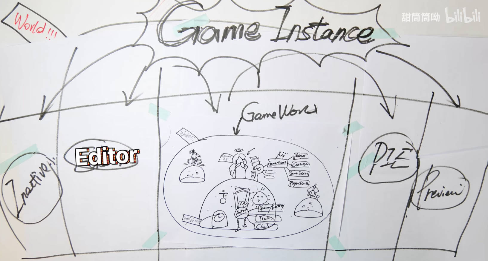

# UnrealEngine5.x.x
[TOC]
## 0.基本概念
### 0. UE World GamePlay框架

* Level：关卡，一块大陆就是一个Level
* UObject：万物皆UObject，提供C++的元数据、反射回收、序列化等功能
*  Actor：Lavel上存在的对象，不止是会动的才是Actor，相机、灯光、地形都是Actor，包括GameMode等一些不可见的对象也继承自Actor，不过没有具体的位置、Transform等属性【所以不能用是否能放在地图里来定义是否为Actor】
	* Actor的特性为：Spawn & Destory【能出生或死亡】、Tick【有心跳】、Replication【复制，即具有子类Child，比如很经典的Pawn就是Actor的子类】，Actor之间可以相互嵌套，拥有相对的父子关系
	* 问：一个对象要在3D世界中表示必然有Transform Matrix表示位置信息，为什么Actor不和Transform属性绑定在一起呢
		* 答：在UE看来，Actor并不只是3D中的“表示”，一些不在世界里展示的“不可见对象”也可以是Actor比如AGameMode代表这个Level里面的各种信息状态规则，可以看作一个无形工作的灵体Actor，所以，在UE中，Actor是这个世界中的种种元素，小到一株草，大到运行法则都是Actor。对于Transform更像Actor的一种额外能力，被封装进SceneComponent中作为RootComponent
* Component：组件，Actor装备上不同的Component技能就变成了独一无二的自己，UActorComponent也是基于UObject，也拥有其对应的通用功能
* Level BP：关卡蓝图，配合World Settings【管理物理、光照的规则】对Actor进行管理
* World Settings：世界设置，GameMode是其重要的组成部分
	* GameMode：对规则进行制定及管理，比如定义了Player是谁、Controller是谁、GameState、PlayerState等，编写的逻辑较为抽象
* GameWorld：无数的Level的集合体就是GameWorld
* World：无数平行的GameWorld就是World【平行宇宙！】，UE编辑器Editor本身也是一个World，测试环境PIE、Inactive、Preview也是一个World【对，源码扒出来一共五个】
* Game Instance：World之上，随着引擎启动关闭而生成和销毁，所以生命周期是最长的【不会倒闭的银行】，重要的数据可以先存在GameInstance里面，需要的时候再拿出来
* 上述对于GamePlay的理解也就决定了代码该写在什么层次

### 1.源码架及约定
#### 1.1 项目默认生成部分
* Config：存放ini配置文件，生成默认配置的Editor\Engine\Game
* Binaries：存放编译生成的结果二进制文件【gitignore，每次都会生成】
* Content：存放所有的资源和蓝图
* DerivedDataCache：DDC，存放引擎针对不同运行平台的资源版本，比如同一个图片对于PC和移动端有不同的适合格式【gitignore】
* Intermediate：存放临时生成文件，比如Build的*.obj*中间文件，编译生成的Shader文件，AssetRegistryCache【一个对于所有uassets资源信息的注册表】【gitignore】
* Saved：存储自动保存文件，其他配置文件，日志文件，引擎崩溃日志，硬件信息，烘培信息数据等。【gitignore】
* Source：存放源码文件

#### 1.2 编译及变量命名规定
* 编译
	* UBT:Unreal Build Tool，即虚幻构建工具，编译UE逐个模块并处理以来，*.cs*文件 为这个工具服务
	* UHT：Unreal Header Tool，即 虚幻头文件工具，负责对C++代码解析生成工具，各种前缀的类都为UHT提供信息来生成对应的C++反射代码
	* 工作流程：一般UBT先调用UHT对代码进行解析，再生产相应其它代码，调用平台特定的编译工具进行各个模块的编译，最后启动Editor或者Game
* 命名规定
    * 模板类：以T作为前缀，比如TMap，TSet等
    * UObject派生类：以U前缀
    * AActor派生类：以A为前缀
    * Swidget派生类：以S为前缀
    * 抽象界面类以I为前缀
    * 枚举的前缀为E
    * 在C# 中，类型名是省略前缀的
    * 应避免在同一个API中混合使用UE和标准库规范
* 特点
	* 资源节约：UE抠门到bool变量都要写成uint bPending:1，位域来节省一个字节的内存的

	
## 2.Issues
### 通用
* Error:LS-0013：无法启动游戏【使用管理员的方式打开Epic Launcher】
* 关于不显示预览窗口的问题【Windows里面设置默认布局】
* C++项目中默认没有GameMode的蓝图

## 参考目录
