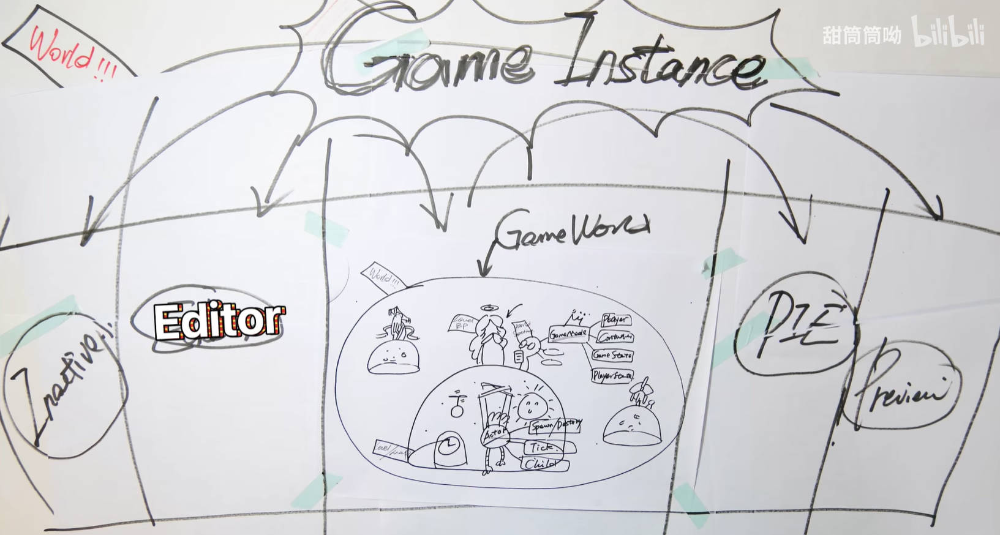
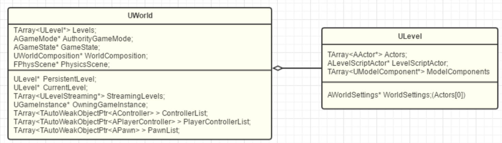
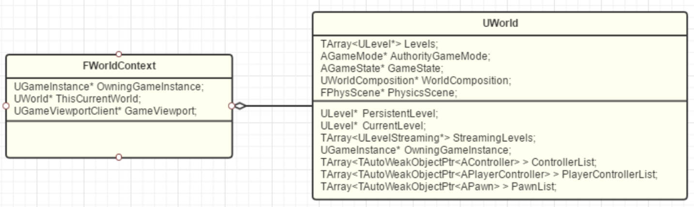
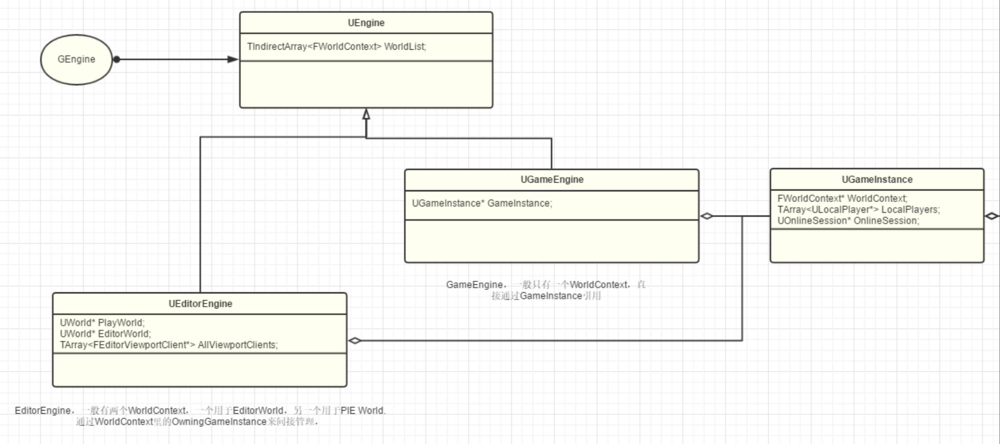
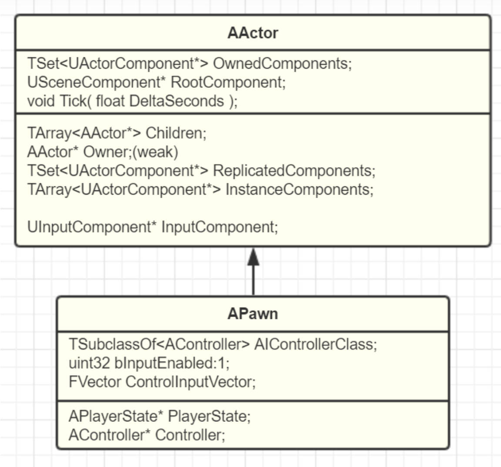
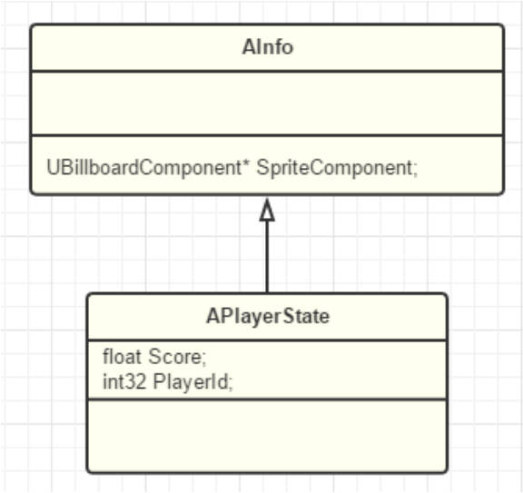
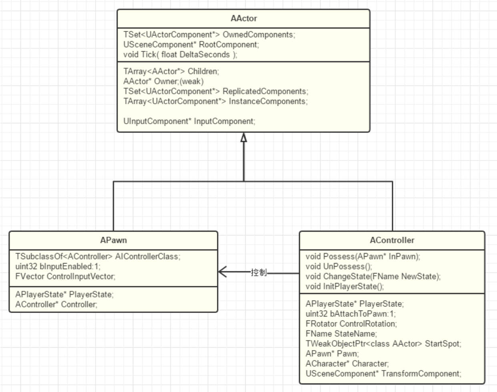

# UnrealEngine5.x.x
[TOC]
## 1.基本概念
### 1.1 UE World GamePlay框架

#### 1.1.1 UObject、Actor、Component
* UObject：万物皆UObject，提供C++的元数据、反射回收、序列化等功能
*  Actor：Level上存在的对象，不止是会动的才是Actor，相机、灯光、地形都是Actor，包括GameMode等一些不可见的对象也继承自Actor，不过没有具体的位置、Transform等属性【所以不能用是否能放在地图里来定义是否为Actor】
	* Actor的特性为：Spawn & Destory【能出生或死亡】、Tick【有心跳】、Replication【复制，即具有子类Child，比如很经典的Pawn就是Actor的子类】，Actor之间可以相互嵌套，拥有相对的父子关系
	* 一个Actor若想可以被放进Level里，就必须实例化RootComponent
	* 问：一个对象要在3D世界中表示必然有Transform Matrix表示位置信息，为什么Actor不和Transform属性绑定在一起呢
	  * 答：在UE看来，Actor并不只是3D中的“表示”，一些不在世界里展示的“不可见对象”也可以是Actor比如AGameMode代表这个Level里面的各种信息状态规则，可以看作一个无形工作的灵体Actor，所以，在UE中，Actor是这个世界中的种种元素，小到一株草，大到运行法则都是Actor。对于Transform更像Actor的一种额外能力，被封装进SceneComponent中作为RootComponent
* Component：组件，表达的是“功能”的概念，Actor装备上不同的Component技能就变成了独一无二的自己，UActorComponent也是基于UObject，也拥有其对应的通用功能。
	* **在这一层级上要编写的逻辑是实现一个个“与特定游戏无关”的功能**，理想情况下，一个游戏完成时，那些**已经实现完成的Components是可以无痛迁移到下一个游戏中用的**
	* 问：Actor和Component之间的关系
	  * 答：一个名为TSet<UActorComponent*> OwnedComponents 保存着这个Actor所拥有的所有Component,一般其中会有一个SceneComponent作为RootComponent。当Actor被实例化后，附属的Component也会被实例化，这时候就出现了TArray<UActorComponent*> InstanceComponents，保存着实例化的Components
	* 关于上面提到的SceneComponent，多提一句，SceneComponent提供了两大能力，一个就是Transform一个就是SceneComponent之间的相互嵌套【ActorComponent是不能嵌套的，在UE的观念里，只有带Transform的SceneComponent才有资格被嵌套，Component的互相嵌套必须和3D里的transform父子对应起来。】	
	

#### 1.1.2 Level、World
* Level：关卡，一块大陆就是一个Level，就是*.map*文件，类为ULevel，所以也是继承自UObject的
	* ALevelScriptActor：土地公，允许在关卡里面编写脚本
	* AInfo：书记官，各个Level所需要的功能都差不多，都是修改一下光照，物理等一些属性，所以使用ALevel记录着本Level的各种规则属性 
		* World Settings：世界设置，一个常见的AInfo,GameMode是其重要的组成部分,虽然名字叫做WorldSettings，但其实只是跟Level相关。
			* GameMode：对规则进行制定及管理，比如定义了Player是谁、Controller是谁、GameState、PlayerState等，编写的逻辑较为抽象
		* 问：在代码中，为何AWorldSettings要放进在Actors[0]的位置？而ALevelScriptActor却不用？
			* 答：AWorldSettings因为都是静态的数据提供者，在游戏运行过程中也不会改变，不需要网络复制，所以也就可以一直放在前列，而如果再加个规则，一直放在第一个的话，也能同时把AWorldSettings和其他的前列Actor们再度区分开，在需要的时候也能加速判断。ALevelScriptActor因为是代表关卡蓝图，是允许携带“复制”变量函数的，所以也有可能被排序到后列。
	* Level BP：关卡蓝图，配合World Settings【管理物理、光照的规则】对Actor进行管理
* GameWorld：一个或无数的Level的集合体就是GameWorld
	* 问：一个World里有多个Level，这些Level在什么位置，是在一开始就加载进来，还是Streaming运行时加载？
    
	  * 答：Persistent的意思是一开始就加载进World，Streaming是后续动态加载的意思。Levels里保存有所有的当前已经加载的Level，StreamingLevels保存整个World的Levels配置列表。PersistentLevel和CurrentLevel只是个快速引用。在编辑器里编辑的时候，CurrentLevel可以指向其他Level，但运行时CurrentLevel只能是指向PersistentLevel
  * 问：为何要有主PersistentLevel？ 
    * 答：World至少得有一个Level，就像你也得先出生在一块大陆上才可以继续谈起去探索别的新大陆。所以这块玩家出生的大陆就是主Level了。当然了，因为我们也可以同时配置别的Level一开始就加载进来，其实跟PersistentLevel是差不多等价的，但再考虑到另一问题：Levels拼接进World一起之后，各自有各自的worldsetting，那整个World的配置应该以谁的为主？World的Settings也是以PersistentLevel为主的

#### 1.1.3 World、Game Instance、Engine
* World：无数平行的GameWorld就是World【平行宇宙！】，显示的游戏场景是一个World，UE编辑器Editor本身也是一个World，测试环境PIE【A Play In Editor world】、Inactive、Preview也是一个World【对，源码扒出来一共五个】
  * 用来管理和跟踪这些World得到工具就是WorldContext，既负责World之间切换的上下文信息，也负责Level之间切换的信息。比如，FWorldContext保存着ThisCurrentWorld来指向当前的World。而当需要从一个World切换到另一个World的时候（比如说当点击播放时，就是从Preview切换到PIE），FWorldContext就用来保存切换过程信息和目标World上下文信息。一般就来说，对于独立运行的游戏，WorldContext只有唯一个。而对于编辑器模式，则是一个WorldContext给编辑器，一个WorldContext给PIE。同时FWorldContext还保存着World里Level切换的上下文
    
    * 问：为什么Level的切换信息不放在World里？
      * 答：因为UE一个World只有一个PersistentLevel，而当我们OpenLevel【主要用于加载并进入一个新的关卡。这个操作会销毁当前的关卡内容，并加载目标关卡】一个PersistentLevel的时候，实际上引擎做的是先释放掉当前的World，然后再创建个新的World。所以如果我们把下一个Level的信息放在当前的World中，就不得不在释放当前World前又拷贝回来一遍了。
* Game Instance：World之上，玩家能直接接触到的最根源的操作类，随着引擎启动关闭而生成和销毁，所以生命周期是最长的【不会倒闭的银行】，重要的数据可以先存在GameInstance里面，需要的时候再拿出来。也是WorldContext保存的位置，GameInstance里会保存着当前的WorldConext和其他整个游戏的信息，独立于Level的逻辑或数据在GameInstance中存储
   * 服务器和客户端的Game Instance各自独立，互不干预

* Engine：UEngine分化出了两个子类：UGameEngine和UEditorEngine。众所周知，UE的编辑器也是UE用自己的引擎渲染出来的，本质上来说，UE的编辑器其实也是个游戏！我们是在编辑器这个游戏里面创造我们自己的另一个游戏，UE会在不同模式下根据编译环境而采用不同的具体Engine类
   
 * Standalone Game：会使用UGameEngine来创建出唯一的一个GameWorld，因为也只有一个，所以为了方便起见，就直接保存了GameInstance指针
 * UE还不支持同时运行多个World（当前只能一个，但可以切换），所以GameInstance其实也是唯一的

* 上述对于GamePlay的理解也就决定了代码该写在什么层次，依次理清一下层次大概为Object->Actor+Component->Level->World->WorldContext->GameInstance->Engine
* 一些思考
  * 问：Actor之间父子关系如何确定？
  	* 答：UE里，Actor之间的父子关系却是通过Component确定的。同一般的Parent:AddChild操作原语不同，UE里是通过Child:AttachToActor或Child:AttachToComponent来创建父子连接的。父子关系的维护交给具体的Component，Actor本身并不关心

#### 1.1.4  Pawn

问：什么是逻辑？【所谓的游戏业务逻辑，实际上编写的就是该如何对玩家的输入提供反馈】

问：那些Actor需要附加逻辑？【一个Actor想要变得“生动”，就得有响应外部输入的能力，否则就只是自动运转麻木的机器人。但是在一个比较大型的3D游戏中，Actor有千千万万，然后并不是所有的Actor都需要和玩家互动，于是能够被操作、或能够进行互动的Actor宠儿出现了，他就是Pawn】
 

* Pawn：兵卒，如果把UE游戏看作是一场棋盘上的游戏的话，那这些Pawn就可以看作是在UE的3D世界中玩家可以操纵的棋子，而其他的Actor则可以构成棋盘等,Pawn就是那些可以被玩家（你或AI）控制的Actor。Pawn也从Actor中派生出来，提供了三个基本的模版方法接口PhysicsCollision【自身存在允许物理碰撞】、MovementInput【可以移动】、Controller【可以响应输入和处理逻辑】
  * 棋子本身只能简单的表达出出个棋子，但是该如何走还是得再靠外部的Controller机制。Pawn也可以想象成提线木偶，而提线的是Controller。Pawn表达的最关键点是可被玩家操纵的能力

  * 问：为何Actor也能接受Input事件？
    * 答：上述概念描述让我们觉得应该在Pawn上同时实现对输入的接受。但我们会发现实际上EnableInput接口却是在Actor上的，同时InputComponent也是在Actor里面的，意味着实际上你也可以在Actor上绑定处理输入事件。理解这个问题的要点在于**正确区分“输入响应”和“逻辑控制”**。比如说WASD移动，Actor拥有最基本的输入响应，它可以响应WASD的按键事件。但是按键了之后呢？该如何移动？Pawn就定义了一个基本的MovementInput套路，相当于把WASD的输入响应再往前包装处理了一步。而**“逻辑控制”指的是更高层上的比如寻路或自动巡逻等行为。**

  * 特殊的Pawn:DefaultPawn，SpectatorPawn，Character
    * DefaultPawn：UE提供的默认的Pawn，不需要再单独添加组件，默认带上面提及的模版方法接口
    * SpectatorPawn：派生于DefaultPawn的SpectatorPawn提供了一个基本的USpectatorPawnMovement（不带重力漫游），并关闭了StaticMesh的显示，碰撞也设置到了“Spectator”通道。可以理解为观战玩家
    * Character：由于大多数角色都是人形，Character则是UE提供的人形的Pawn，拥有像人一样行走的CharacterMovementComponent，尽量贴合的CapsuleComponent，再加上骨骼上蒙皮的网格
    * 对于Pawn还是Character的选择问题：Character是Pawn的加强特化版本。如果控制的角色是人形的带骨骼的，选择Character。如果是VR中的一双手（假设只有一双手），因为移动模式和显示都算不太上人形，顶多只能算是个漂浮的“幽灵”，所以还是用Pawn方便些。后期如果你想加上人形模型和IK了，那么再把Mesh替换成SkeletalMesh也就行了，Pawn因为是基础款，所以提供了最大的灵活性。

#### 1.1.5  Controller
不管是游戏，还是其他App，Web或Server等，本质上都是程序，所以也都是或多或少需要一些程序逻辑，如果依照纯朴的"程序=数据+算法"的结构来看，再算上用于用户显示和输入的界面，那么就得到“程序=数据+算法+显示”。
* MVC：对于游戏，显示”指的是游戏的UI，是屏幕上显示的3D画面，或是手柄上的输入和震动，也可以是VR头盔的镜片和定位，是与玩家直接交互的载体；“数据”指的是Mesh，Material，Actor，Level等各种元素组织起来的内存数据表示；算法”可以是各种渲染算法，物理模拟，AI寻路，也可以是游戏开发者们编写的游戏业务逻辑。抽象这三个变化，并归纳关系，就是典型的MVC模式。
* Controller：UE在MVC设计上让一些Actor专门来承载逻辑，于是，Actor再度分化出Controller
  * 先来探讨一下控制希望达到的目标：
    * 能够和Pawn对应起来：理想情况下，极端的灵活性应该是多对多。希望能同时控制多个Pawn，当然，一个Pawn也可以被多个控制器一起控制，即存在一个和Pawn关联的机制
    * 多个控制实例：希望控制器能有多个实例同时运行同一段逻辑，彼此互不干扰
    * 可挂载释放：可以灵活的选择控制Pawn，增删对Pawn的能力
    * 操纵Pawn生死的能力：当世界里没有Pawn可供我控制时，可以自己造一个出来
    * 根据配置自动生成：得有个机制可以生成控制实体，根据一定的配置规则进行自动生成
    * 事件响应：对于控制行为关心的事件能够传递到控制器
    * 持续运行且自身有状态，且有一定的扩展继承组合能力，且可以在不同的客户端上同步，能保存数据状态，可以在World中移动【任意位置对Pawn进行操控】
    * 综上，最适合当一个Controller的就是Actor，Actor比Object多了一些需要的配置动态生成、输入事件响应、Tick、可继承、可容纳Component、可在世界里出现、可在网络间同步。就差控制Pawn的能力，在分化出来的AController增加一些控制Pawn的接口，就有了控制器

  * AController：
    * 存在属性Possess UnPossess表示对一个Pawn的拥有占用及释放
    * 问：Controller和Pawn必须1:1吗？
      * 答：观察UE源码实现里我们发现Controller里只是保存了一个Pawn指针，而不是数组，这和一开始希望的多对多关系有些出入。一个Controller能灵活的Possess/UnPossess一个Pawn，虽然一次只能控制一个，但在游戏中我们也可以在不同的Pawn中切换，比如操纵一个主角坐进然后控制一辆汽车，或者端起固定的机关枪扫射，这些功能琢磨一下其实只是涉及操作实体Pawn的变化。如果我们能妥善的用好Pawn和Controller的切换功能，大部分基本的游戏功能也是能够比较方便的实现的。按照官方文档的话即是“默认情况下，Controller和Pawn是一对一的关系，每个控制器在任何给定的时间仅控制一个Pawn，对于大多数游戏是能接受的，但某些类型的策略游戏可能需要控制多个实体的能力，则需要在Controller里面自己实现扩展，额外保存多个Pawn，实现一些需要的控制实现”

    * 问：Actor可以藉着身上的SceneComponent互相嵌套。那么AController同样也是Actor，为何Controller不能像Actor层级嵌套？
      * 答：Controller表达的“控制”的概念，若想要表达的是一种“控制”互相嵌套的概念，感觉又给“控制”给分了层，有“大控制”，也有“小控制”，但是“控制”的“大小”又是个什么概念呢？我们应该怎么划分控制的大小？“控制”本质上来说就是一些代码，不管怎么设计，目的都是用来表达游戏游戏逻辑的。而针对游戏逻辑的复杂，怎么更好的管理组织逻辑代码，我们有状态机，分层状态机，行为树，GOAL（目标导向），在已经有这么多工具的基础上，徒增复杂性是很危险的做法。【我觉得这个回答写的好好！】

    * 问：Controller可以显示吗？
      * 答：因为Controller本身确实就是一个特殊点的Actor而已，你依然可以在Controller中添加Mesh组件，添加别的子Actor等，所以从这个方面说Controller是有可以渲染显示的能力的。但是一个控制者毕竟只是表达一个逻辑的概念，所以为了分工明确，UE就干脆在Controller的构造函数里把自己给隐藏了。

    * 问：Controller的位置有什么意义？既然Controller本身只是控制者，那它在场景中的位置和移动有什么意义吗？Controller为何还需要个SceneComponent?
      * 答：意义在于如果Controller本身有位置信息，就可以利用该信息更好的控制Pawn的位置和移动。首先说下Controller的Rotation，如果想让Pawn和Controller保持旋转朝向一致，因为是Controller作主控制Pawn的关系，所以Controller就得维护自己的Rotation。再来说位置，如果Controller有自己的位置，这样在Respawn重新生成Pawn的时候，就可以选择在当前位置创建。因此为了自动更新Controller的位置，UE还提供了一个bAttachToPawn的开关选项，默认是关闭的，UE不会自动的更新Controller的位置信息；而如果打开，就会把Controller附加到Pawn的子节点里面去，让Controller跟随Pawn来移动。【一种是上帝视角在千里之外心电感应控制Pawn，另一种是骑在Pawn肩上来指挥。】如果这个Controller确实只是纯朴的逻辑控制的话（如AIController），那确实位置也没什么意义。所以UE隐藏了Controller的一些更新位置的接口，尽量避免让人手动去操纵

    * 问：哪些逻辑应该写在Controller中？
      * 答：Pawn也可以接收用户输入事件，所以其实只要你愿意，你甚至可以脱离Controller做一个特立独行的Pawn。从概念上，Pawn本身表示的是一个“能动”的概念，重点在于“能”。而Controller代表的是动到“哪里”的概念，重点在于“方向”。
        * 所以如果是一些Pawn本身固有的能力逻辑，如前进后退、播放动画、碰撞检测之类的就完全可以在Pawn内实现；而对于一些可替换的逻辑，或者智能决策的，就应该归Controller管辖。
        * 如果一个逻辑只属于某一类Pawn，那么其实你放进Pawn内也挺好。而如果一个逻辑可以应用于多个Pawn，那么放进Controller就可以组合应用了。举个例子，在战争游戏中，假设说有坦克和卡车两种战车（Pawn），只有坦克可以开炮，那么开炮这个功能你就可以直接实现在坦克Pawn上。而这两辆战车都有的自动寻找攻击目标功能，就可以实现在一个Controller里。
        * 从存在性来说，Controller的生命期比Pawn要长一些，比如我们经常会实现的游戏中玩家死亡后复活的功能。**Pawn死亡后，这个Pawn就被Destroy了，就算之后再Respawn创建出来一个新的，但是Pawn身上保存的变量状态都已经被重置了。所以对于那些需要在Pawn之外还要持续存在的逻辑和状态，放进Controller中是更好的选择。**【很好的例子】

  * APlayerState：整个游戏世界构建起来就是为了玩家服务的，而玩家在游戏过程中，肯定要存取产生一些状态。而Controller作为游戏业务逻辑最重要的载体，势必要和玩家的状态打交道。
   
    * APlayerState从AActor派生的AInfo继承下来，图的就是AActor本身的那些特性以网络复制等，而AInfo们正是这种不爱表现的纯数据书呆子们的大本营。【哈哈哈哈】
    * APlayerState也理所当然是生成在Level中的，跟Pawn和Controller是平级的关系，Controller里只不过保存了一个指针引用罢了。PlayerState只为players存在，不为NPC生成，指的是PlayerState是跟UPlayer对应的，换句话说当前游戏有多少个真正的玩家，才会有多少个PlayerState，而AI控制的NPC因为不是真正的玩家，所以也不需要创建生成PlayerState。但是UE把PlayerState的引用变量放在了Controller一级，而不是PlayerController之中，说明了其实AIController也是可以设置读取该变量的。**一个AI智能能够读取玩家的比分等状态，有了更多的信息来作决策**。【读指令是吧！】
    * 把PlayerState独立构成一个Actor还有一个好处，当玩家偶尔因网络波动断线，因为这个连接不在了，所以该Controller也失效了被释放了，服务器可以把对应的该PlayerState先暂存起来，等玩家再紧接着重连上了，可以利用该PlayerState重新挂接上Controller，以此提供一个比较顺畅无缝的体验。至于AIController，因为都是运行在Server上的，Client上并没有，所以也就无所谓了【好好理解这一段】
    * 问：哪些数据应该放在PlayerState中？
      * 答：PlayerState表示的是玩家的游玩数据，所以关卡内的其他游戏数据就不应该放进来【GameState是个好选择】，另外Controller本身运行需要的临时数据也不应该归PlayerState管理。而玩家在切换关卡的时候，APlayerState也会被释放掉，**所有PlayerState实际上表达的是当前关卡的玩家得分等数据**。这样，那些跨关卡的统计数据等就也不应该放进PlayerState里了，应该放在外面的GameInstance，然后用SaveGame保存起来。
    * 文章小结：UE在Pawn这个层级演化构成了一个最基本和非常完善的Component-Actor-Pawn-Controller的结构
   

### 1.2 源码架及约定

#### 1.2.1 项目默认生成部分
* Config：存放ini配置文件，生成默认配置的Editor\Engine\Game
* Binaries：存放编译生成的结果二进制文件【gitignore，每次都会生成】
* Content：存放所有的资源和蓝图
* DerivedDataCache：DDC，存放引擎针对不同运行平台的资源版本，比如同一个图片对于PC和移动端有不同的适合格式【gitignore】
* Intermediate：存放临时生成文件，比如Build的*.obj*中间文件，编译生成的Shader文件，AssetRegistryCache【一个对于所有uassets资源信息的注册表】【gitignore】
* Saved：存储自动保存文件，其他配置文件，日志文件，引擎崩溃日志，硬件信息，烘培信息数据等。【gitignore】
* Source：存放源码文件

#### 1.2.2 编译及变量命名规定
* 编译
	* UBT:Unreal Build Tool，即虚幻构建工具，编译UE逐个模块并处理以来，*.cs*文件 为这个工具服务
	* UHT：Unreal Header Tool，即 虚幻头文件工具，负责对C++代码解析生成工具，各种前缀的类都为UHT提供信息来生成对应的C++反射代码
	* 工作流程：一般UBT先调用UHT对代码进行解析，再生产相应其它代码，调用平台特定的编译工具进行各个模块的编译，最后启动Editor或者Game
* 命名规定
    * 模板类：以T作为前缀，比如TMap，TSet等
    * UObject派生类：以U前缀
    * AActor派生类：以A为前缀
    * Swidget派生类：以S为前缀
    * 抽象界面类以I为前缀
    * 枚举的前缀为E
    * 在C# 中，类型名是省略前缀的
    * 应避免在同一个API中混合使用UE和标准库规范
* 特点
	* 资源节约：UE抠门到bool变量都要写成uint bPending:1，位域来节省一个字节的内存的

	
## 2.Issues
### 通用
* Error:LS-0013：无法启动游戏【使用管理员的方式打开Epic Launcher】
* 关于不显示预览窗口的问题【Windows里面设置默认布局】
* C++项目中默认没有GameMode的蓝图

## 参考目录
