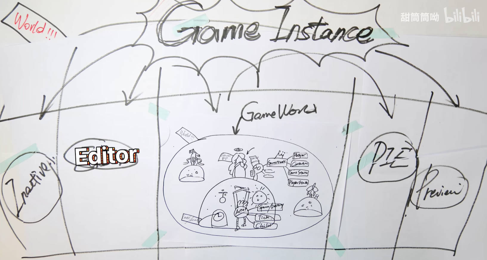

# UnrealEngine5.x.x

[TOC]
## 0.源码框架及约定
### 0.1 项目默认生成部分
* Config：存放ini配置文件，生成默认配置的Editor\Engine\Game
* Binaries：存放编译生成的结果二进制文件【gitignore，每次都会生成】
* Content：存放所有的资源和蓝图
* DerivedDataCache：DDC，存放引擎针对不同运行平台的资源版本，比如同一个图片对于PC和移动端有不同的适合格式【gitignore】
* Intermediate：存放临时生成文件，比如Build的*.obj*中间文件，编译生成的Shader文件，AssetRegistryCache【一个对于所有uassets资源信息的注册表】【gitignore】
* Saved：存储自动保存文件，其他配置文件，日志文件，引擎崩溃日志，硬件信息，烘培信息数据等。【gitignore】
* Source：存放源码文件

###  0.2 编译及变量命名规定
* 编译
	* UBT:Unreal Build Tool，即虚幻构建工具，编译UE逐个模块并处理以来，*.cs*文件 为这个工具服务
	* UHT：Unreal Header Tool，即 虚幻头文件工具，负责对C++代码解析生成工具，各种前缀的类都为UHT提供信息来生成对应的C++反射代码
	* 工作流程：一般UBT先调用UHT对代码进行解析，再生产相应其它代码，调用平台特定的编译工具进行各个模块的编译，最后启动Editor或者Game
* 命名规定
    * 模板类：以T作为前缀，比如TMap，TSet等
    * UObject派生类：以U前缀
    * AActor派生类：以A为前缀
    * Swidget派生类：以S为前缀
    * 抽象界面类以I为前缀
    * 枚举的前缀为E
    * 在C# 中，类型名是省略前缀的
    * 应避免在同一个API中混合使用UE和标准库规范
* 特点
	* 资源节约：UE抠门到bool变量都要写成uint bPending:1，位域来节省一个字节的内存的

## 1.UE World GamePlay
### 1.1 GamePlay概览

#### 1.1.1 UObject、Actor、Component
* UObject：万物皆UObject，提供C++的元数据、反射回收、序列化等功能
*  Actor：Level上存在的对象，不止是会动的才是Actor，相机、灯光、地形都是Actor，包括GameMode等一些不可见的对象也继承自Actor，不过没有具体的位置、Transform等属性【所以不能用是否能放在地图里来定义是否为Actor】
	* Actor的特性为：Spawn & Destory【能出生或死亡】、Tick【有心跳】、Replication【复制，即具有子类Child，比如很经典的Pawn就是Actor的子类】，Actor之间可以相互嵌套，拥有相对的父子关系
	* 一个Actor若想可以被放进Level里，就必须实例化RootComponent
	* 问：一个对象要在3D世界中表示必然有Transform Matrix表示位置信息，为什么Actor不和Transform属性绑定在一起呢
	  * 答：在UE看来，Actor并不只是3D中的“表示”，一些不在世界里展示的“不可见对象”也可以是Actor比如AGameMode代表这个Level里面的各种信息状态规则，可以看作一个无形工作的灵体Actor，所以，在UE中，Actor是这个世界中的种种元素，小到一株草，大到运行法则都是Actor。对于Transform更像Actor的一种额外能力，被封装进SceneComponent中作为RootComponent
* Component：组件，表达的是“功能”的概念，Actor装备上不同的Component技能就变成了独一无二的自己，UActorComponent也是基于UObject，也拥有其对应的通用功能。
	* **在这一层级上要编写的逻辑是实现一个个“与特定游戏无关”的功能**，理想情况下，一个游戏完成时，那些**已经实现完成的Components是可以无痛迁移到下一个游戏中用的**
	* 问：Actor和Component之间的关系
	  * 答：一个名为TSet<UActorComponent*> OwnedComponents 保存着这个Actor所拥有的所有Component,一般其中会有一个SceneComponent作为RootComponent。当Actor被实例化后，附属的Component也会被实例化，这时候就出现了TArray<UActorComponent*> InstanceComponents，保存着实例化的Components
	* 关于上面提到的SceneComponent，多提一句，SceneComponent提供了两大能力，一个就是Transform一个就是SceneComponent之间的相互嵌套【ActorComponent是不能嵌套的，在UE的观念里，只有带Transform的SceneComponent才有资格被嵌套，Component的互相嵌套必须和3D里的transform父子对应起来。】	
	

#### 1.1.2 Level、World
* Level：关卡，一块大陆就是一个Level，就是*.map*文件，类为ULevel，所以也是继承自UObject的
	* ALevelScriptActor：土地公，允许在关卡里面编写脚本
	* AInfo：书记官，各个Level所需要的功能都差不多，都是修改一下光照，物理等一些属性，所以使用ALevel记录着本Level的各种规则属性 
		* World Settings：世界设置，一个常见的AInfo,GameMode是其重要的组成部分,虽然名字叫做WorldSettings，但其实只是跟Level相关。
			* GameMode：对规则进行制定及管理，比如定义了Player是谁、Controller是谁、GameState、PlayerState等，编写的逻辑较为抽象
		* 问：在代码中，为何AWorldSettings要放进在Actors[0]的位置？而ALevelScriptActor却不用？
			* 答：AWorldSettings因为都是静态的数据提供者，在游戏运行过程中也不会改变，不需要网络复制，所以也就可以一直放在前列，而如果再加个规则，一直放在第一个的话，也能同时把AWorldSettings和其他的前列Actor们再度区分开，在需要的时候也能加速判断。ALevelScriptActor因为是代表关卡蓝图，是允许携带“复制”变量函数的，所以也有可能被排序到后列。
	* Level BP：关卡蓝图，配合World Settings【管理物理、光照的规则】对Actor进行管理
* GameWorld：一个或无数的Level的集合体就是GameWorld
	* 问：一个World里有多个Level，这些Level在什么位置，是在一开始就加载进来，还是Streaming运行时加载？
    
	  * 答：Persistent的意思是一开始就加载进World，Streaming是后续动态加载的意思。Levels里保存有所有的当前已经加载的Level，StreamingLevels保存整个World的Levels配置列表。PersistentLevel和CurrentLevel只是个快速引用。在编辑器里编辑的时候，CurrentLevel可以指向其他Level，但运行时CurrentLevel只能是指向PersistentLevel
  * 问：为何要有主PersistentLevel？ 
    * 答：World至少得有一个Level，就像你也得先出生在一块大陆上才可以继续谈起去探索别的新大陆。所以这块玩家出生的大陆就是主Level了。当然了，因为我们也可以同时配置别的Level一开始就加载进来，其实跟PersistentLevel是差不多等价的，但再考虑到另一问题：Levels拼接进World一起之后，各自有各自的worldsetting，那整个World的配置应该以谁的为主？World的Settings也是以PersistentLevel为主的

#### 1.1.3 World、Game Instance、Engine
* World：无数平行的GameWorld就是World【平行宇宙！】，显示的游戏场景是一个World，UE编辑器Editor本身也是一个World，测试环境PIE【A Play In Editor world】、Inactive、Preview也是一个World【对，源码扒出来一共五个】
  * 用来管理和跟踪这些World得到工具就是WorldContext，既负责World之间切换的上下文信息，也负责Level之间切换的信息。比如，FWorldContext保存着ThisCurrentWorld来指向当前的World。而当需要从一个World切换到另一个World的时候（比如说当点击播放时，就是从Preview切换到PIE），FWorldContext就用来保存切换过程信息和目标World上下文信息。一般就来说，对于独立运行的游戏，WorldContext只有唯一个。而对于编辑器模式，则是一个WorldContext给编辑器，一个WorldContext给PIE。同时FWorldContext还保存着World里Level切换的上下文
    
    * 问：为什么Level的切换信息不放在World里？
      * 答：因为UE一个World只有一个PersistentLevel，而当我们OpenLevel【主要用于加载并进入一个新的关卡。这个操作会销毁当前的关卡内容，并加载目标关卡】一个PersistentLevel的时候，实际上引擎做的是先释放掉当前的World，然后再创建个新的World。所以如果我们把下一个Level的信息放在当前的World中，就不得不在释放当前World前又拷贝回来一遍了。
* Game Instance：World之上，玩家能直接接触到的最根源的操作类，随着引擎启动关闭而生成和销毁，所以生命周期是最长的【不会倒闭的银行】，重要的数据可以先存在GameInstance里面，需要的时候再拿出来。也是WorldContext保存的位置，GameInstance里会保存着当前的WorldConext和其他整个游戏的信息，独立于Level的逻辑或数据在GameInstance中存储
   * 服务器和客户端的Game Instance各自独立，互不干预

* Engine：UEngine分化出了两个子类：UGameEngine和UEditorEngine。众所周知，UE的编辑器也是UE用自己的引擎渲染出来的，本质上来说，UE的编辑器其实也是个游戏！我们是在编辑器这个游戏里面创造我们自己的另一个游戏，UE会在不同模式下根据编译环境而采用不同的具体Engine类
   
 * Standalone Game：会使用UGameEngine来创建出唯一的一个GameWorld，因为也只有一个，所以为了方便起见，就直接保存了GameInstance指针
 * UE还不支持同时运行多个World（当前只能一个，但可以切换），所以GameInstance其实也是唯一的

* 上述对于GamePlay的理解也就决定了代码该写在什么层次，依次理清一下层次大概为Object->Actor+Component->Level->World->WorldContext->GameInstance->Engine
* 一些思考
  * 问：Actor之间父子关系如何确定？
  	* 答：UE里，Actor之间的父子关系却是通过Component确定的。同一般的Parent:AddChild操作原语不同，UE里是通过Child:AttachToActor或Child:AttachToComponent来创建父子连接的。父子关系的维护交给具体的Component，Actor本身并不关心

### 1.2 Actor展开聊聊
#### 1.2.1  Pawn
问：什么是逻辑？【所谓的游戏业务逻辑，实际上编写的就是该如何对玩家的输入提供反馈】
问：那些Actor需要附加逻辑？【一个Actor想要变得“生动”，就得有响应外部输入的能力，否则就只是自动运转麻木的机器人。但是在一个比较大型的3D游戏中，Actor有千千万万，然后并不是所有的Actor都需要和玩家互动，于是能够被操作、或能够进行互动的Actor宠儿出现了，他就是Pawn】
 

* Pawn：兵卒，如果把UE游戏看作是一场棋盘上的游戏的话，那这些Pawn就可以看作是在UE的3D世界中玩家可以操纵的棋子，而其他的Actor则可以构成棋盘等,Pawn就是那些可以被玩家（你或AI）控制的Actor。Pawn也从Actor中派生出来，提供了三个基本的模版方法接口PhysicsCollision【自身存在允许物理碰撞】、MovementInput【可以移动】、Controller【可以响应输入和处理逻辑】
  * 棋子本身只能简单的表达出出个棋子，但是该如何走还是得再靠外部的Controller机制。Pawn也可以想象成提线木偶，而提线的是Controller。Pawn表达的最关键点是可被玩家操纵的能力

  * 问：为何Actor也能接受Input事件？
    * 答：上述概念描述让我们觉得应该在Pawn上同时实现对输入的接受。但我们会发现实际上EnableInput接口却是在Actor上的，同时InputComponent也是在Actor里面的，意味着实际上你也可以在Actor上绑定处理输入事件。理解这个问题的要点在于**正确区分“输入响应”和“逻辑控制”**。比如说WASD移动，Actor拥有最基本的输入响应，它可以响应WASD的按键事件。但是按键了之后呢？该如何移动？Pawn就定义了一个基本的MovementInput套路，相当于把WASD的输入响应再往前包装处理了一步。而**“逻辑控制”指的是更高层上的比如寻路或自动巡逻等行为。**

  * 特殊的Pawn:DefaultPawn，SpectatorPawn，Character
    * DefaultPawn：UE提供的默认的Pawn，不需要再单独添加组件，默认带上面提及的模版方法接口
    * SpectatorPawn：派生于DefaultPawn的SpectatorPawn提供了一个基本的USpectatorPawnMovement（不带重力漫游），并关闭了StaticMesh的显示，碰撞也设置到了“Spectator”通道。可以理解为观战玩家
    * Character：由于大多数角色都是人形，Character则是UE提供的人形的Pawn，拥有像人一样行走的CharacterMovementComponent，尽量贴合的CapsuleComponent，再加上骨骼上蒙皮的网格
    * 对于Pawn还是Character的选择问题：Character是Pawn的加强特化版本。如果控制的角色是人形的带骨骼的，选择Character。如果是VR中的一双手（假设只有一双手），因为移动模式和显示都算不太上人形，顶多只能算是个漂浮的“幽灵”，所以还是用Pawn方便些。后期如果你想加上人形模型和IK了，那么再把Mesh替换成SkeletalMesh也就行了，Pawn因为是基础款，所以提供了最大的灵活性。

#### 1.2.2  Controller
不管是游戏，还是其他App，Web或Server等，本质上都是程序，所以也都是或多或少需要一些程序逻辑，如果依照纯朴的"程序=数据+算法"的结构来看，再算上用于用户显示和输入的界面，那么就得到“程序=数据+算法+显示”。
* MVC：对于游戏，显示”指的是游戏的UI，是屏幕上显示的3D画面，或是手柄上的输入和震动，也可以是VR头盔的镜片和定位，是与玩家直接交互的载体；“数据”指的是Mesh，Material，Actor，Level等各种元素组织起来的内存数据表示；算法”可以是各种渲染算法，物理模拟，AI寻路，也可以是游戏开发者们编写的游戏业务逻辑。抽象这三个变化，并归纳关系，就是典型的MVC模式。
* Controller：UE在MVC设计上让一些Actor专门来承载逻辑，于是，Actor再度分化出Controller
  * 先来探讨一下控制希望达到的目标：
    * 能够和Pawn对应起来：理想情况下，极端的灵活性应该是多对多。希望能同时控制多个Pawn，当然，一个Pawn也可以被多个控制器一起控制，即存在一个和Pawn关联的机制
    * 多个控制实例：希望控制器能有多个实例同时运行同一段逻辑，彼此互不干扰
    * 可挂载释放：可以灵活的选择控制Pawn，增删对Pawn的能力
    * 操纵Pawn生死的能力：当世界里没有Pawn可供我控制时，可以自己造一个出来
    * 根据配置自动生成：得有个机制可以生成控制实体，根据一定的配置规则进行自动生成
    * 事件响应：对于控制行为关心的事件能够传递到控制器
    * 持续运行且自身有状态，且有一定的扩展继承组合能力，且可以在不同的客户端上同步，能保存数据状态，可以在World中移动【任意位置对Pawn进行操控】
    * 综上，最适合当一个Controller的就是Actor，Actor比Object多了一些需要的配置动态生成、输入事件响应、Tick、可继承、可容纳Component、可在世界里出现、可在网络间同步。就差控制Pawn的能力，在分化出来的AController增加一些控制Pawn的接口，就有了控制器

  * AController：
    * 存在属性Possess UnPossess表示对一个Pawn的拥有占用及释放
    * 问：Controller和Pawn必须1:1吗？
      * 答：观察UE源码实现里我们发现Controller里只是保存了一个Pawn指针，而不是数组，这和一开始希望的多对多关系有些出入。一个Controller能灵活的Possess/UnPossess一个Pawn，虽然一次只能控制一个，但在游戏中我们也可以在不同的Pawn中切换，比如操纵一个主角坐进然后控制一辆汽车，或者端起固定的机关枪扫射，这些功能琢磨一下其实只是涉及操作实体Pawn的变化。如果我们能妥善的用好Pawn和Controller的切换功能，大部分基本的游戏功能也是能够比较方便的实现的。按照官方文档的话即是“默认情况下，Controller和Pawn是一对一的关系，每个控制器在任何给定的时间仅控制一个Pawn，对于大多数游戏是能接受的，但某些类型的策略游戏可能需要控制多个实体的能力，则需要在Controller里面自己实现扩展，额外保存多个Pawn，实现一些需要的控制实现”

    * 问：Actor可以藉着身上的SceneComponent互相嵌套。那么AController同样也是Actor，为何Controller不能像Actor层级嵌套？
      * 答：Controller表达的“控制”的概念，若想要表达的是一种“控制”互相嵌套的概念，感觉又给“控制”给分了层，有“大控制”，也有“小控制”，但是“控制”的“大小”又是个什么概念呢？我们应该怎么划分控制的大小？“控制”本质上来说就是一些代码，不管怎么设计，目的都是用来表达游戏游戏逻辑的。而针对游戏逻辑的复杂，怎么更好的管理组织逻辑代码，我们有状态机，分层状态机，行为树，GOAL（目标导向），在已经有这么多工具的基础上，徒增复杂性是很危险的做法。【我觉得这个回答写的好好！】

    * 问：Controller可以显示吗？
      * 答：因为Controller本身确实就是一个特殊点的Actor而已，你依然可以在Controller中添加Mesh组件，添加别的子Actor等，所以从这个方面说Controller是有可以渲染显示的能力的。但是一个控制者毕竟只是表达一个逻辑的概念，所以为了分工明确，UE就干脆在Controller的构造函数里把自己给隐藏了。

    * 问：Controller的位置有什么意义？既然Controller本身只是控制者，那它在场景中的位置和移动有什么意义吗？Controller为何还需要个SceneComponent?
      * 答：意义在于如果Controller本身有位置信息，就可以利用该信息更好的控制Pawn的位置和移动。首先说下Controller的Rotation，如果想让Pawn和Controller保持旋转朝向一致，因为是Controller作主控制Pawn的关系，所以Controller就得维护自己的Rotation。再来说位置，如果Controller有自己的位置，这样在Respawn重新生成Pawn的时候，就可以选择在当前位置创建。因此为了自动更新Controller的位置，UE还提供了一个bAttachToPawn的开关选项，默认是关闭的，UE不会自动的更新Controller的位置信息；而如果打开，就会把Controller附加到Pawn的子节点里面去，让Controller跟随Pawn来移动。【一种是上帝视角在千里之外心电感应控制Pawn，另一种是骑在Pawn肩上来指挥。】如果这个Controller确实只是纯朴的逻辑控制的话（如AIController），那确实位置也没什么意义。所以UE隐藏了Controller的一些更新位置的接口，尽量避免让人手动去操纵

    * 问：哪些逻辑应该写在Controller中？
      * 答：Pawn也可以接收用户输入事件，所以其实只要你愿意，你甚至可以脱离Controller做一个特立独行的Pawn。从概念上，Pawn本身表示的是一个“能动”的概念，重点在于“能”。而Controller代表的是动到“哪里”的概念，重点在于“方向”。
        * 所以如果是一些Pawn本身固有的能力逻辑，如前进后退、播放动画、碰撞检测之类的就完全可以在Pawn内实现；而对于一些可替换的逻辑，或者智能决策的，就应该归Controller管辖。
        * 如果一个逻辑只属于某一类Pawn，那么其实你放进Pawn内也挺好。而如果一个逻辑可以应用于多个Pawn，那么放进Controller就可以组合应用了。举个例子，在战争游戏中，假设说有坦克和卡车两种战车（Pawn），只有坦克可以开炮，那么开炮这个功能你就可以直接实现在坦克Pawn上。而这两辆战车都有的自动寻找攻击目标功能，就可以实现在一个Controller里。
        * 从存在性来说，Controller的生命期比Pawn要长一些，比如我们经常会实现的游戏中玩家死亡后复活的功能。**Pawn死亡后，这个Pawn就被Destroy了，就算之后再Respawn创建出来一个新的，但是Pawn身上保存的变量状态都已经被重置了。所以对于那些需要在Pawn之外还要持续存在的逻辑和状态，放进Controller中是更好的选择。**【很好的例子】

  * APlayerState：整个游戏世界构建起来就是为了玩家服务的，而玩家在游戏过程中，肯定要存取产生一些状态。而Controller作为游戏业务逻辑最重要的载体，势必要和玩家的状态打交道。
   
    * APlayerState从AActor派生的AInfo继承下来，图的就是AActor本身的那些特性以网络复制等，而AInfo们正是这种不爱表现的纯数据书呆子们的大本营。【哈哈哈哈】
    * APlayerState也理所当然是生成在Level中的，跟Pawn和Controller是平级的关系，Controller里只不过保存了一个指针引用罢了。PlayerState只为players存在，不为NPC生成，指的是PlayerState是跟UPlayer对应的，换句话说当前游戏有多少个真正的玩家，才会有多少个PlayerState，而AI控制的NPC因为不是真正的玩家，所以也不需要创建生成PlayerState。但是UE把PlayerState的引用变量放在了Controller一级，而不是PlayerController之中，说明了其实AIController也是可以设置读取该变量的。**一个AI智能能够读取玩家的比分等状态，有了更多的信息来作决策**。【读指令是吧！】
    * 把PlayerState独立构成一个Actor还有一个好处，当玩家偶尔因网络波动断线，因为这个连接不在了，所以该Controller也失效了被释放了，服务器可以把对应的该PlayerState先暂存起来，等玩家再紧接着重连上了，可以利用该PlayerState重新挂接上Controller，以此提供一个比较顺畅无缝的体验。至于AIController，因为都是运行在Server上的，Client上并没有，所以也就无所谓了【好好理解这一段】
    * 问：哪些数据应该放在PlayerState中？
      * 答：PlayerState表示的是玩家的游玩数据，所以关卡内的其他游戏数据就不应该放进来【GameState是个好选择】，另外Controller本身运行需要的临时数据也不应该归PlayerState管理。而玩家在切换关卡的时候，APlayerState也会被释放掉，**所有PlayerState实际上表达的是当前关卡的玩家得分等数据**。这样，那些跨关卡的统计数据等就也不应该放进PlayerState里了，应该放在外面的GameInstance，然后用SaveGame保存起来。
    * 文章小结：UE在Pawn这个层级演化构成了一个最基本和非常完善的Component-Actor-Pawn-Controller的结构
    

#### 1.2.3  PlayerController、AIController
一个游戏里的控制角色大抵都可以分为两类：玩家和AI。不管是单机游戏或者分屏多玩家，还是网络玩家联机对战，游戏都是为了玩家服务的，所以也必然会有一个或多个玩家，而AI的实体的数量就可以是零或者多个。
* APlayerController：一个游戏中只有一个PlayerController，在不同的关卡中你可以使用不同的PlayerController，但是同一时刻响应的只能是一个PlayerController。
	* 拓展：
		* 像《街霸》那种单PC但是多玩家对抗或者协作的游戏。两个玩家可以分别用两个手柄，或者一个用键盘一个用鼠标，甚至是键盘上的不同区域，形式可以多种多样。这个时候如果依然只有一个PlayerController，实现起来其实也是可行的，把两个手柄——所有的输入都由这个PlayerController来接收，然后在PlayerController内部再分别根据情况去处理不同的Pawn，但是这种方式的缺点显然也在于很容易把玩家1、2的输入和控制混杂在一起，没有清晰的区分开。因此，为了支持这种情况，我们可以开始允许游戏中同时出现多个PlayerController，每个PlayerController甚至都可以拥有自己的Viewport（分屏或者不同窗口），这样通过配置可以精确的路由手柄1的输入给玩家1，各自的逻辑也很好的区分和复用。
		* 续：到了网游时代出现有多人联机对战，玩家在自己的PC上控制的只是自己的本地的角色，而屏幕游戏里其他的玩家角色是由网线另一端的玩家控制的。为了更好的适应这种情况，我们就又得扩展一下PlayerController的概念，PlayerController不仅能控制本地的Pawn，而且还能“控制”远程的Pawn（实际上是通过Server上的PlayerController控制Server上的Pawn，然后再复制到远程机器上的Pawn实现的）。
  	
	* PlayerController因为是直接跟玩家打交道的逻辑类，因此是UE里使用最多的类之一，对其进行模块分类，PlayerController作为玩家直接控制的实体，很多的跟玩家直接相关的操作也都得委托它来完成
		* Camera的管理，目的是为了控制玩家的视角，所以有PlayerCameraManager这一个关联很紧密的摄像机管理类，用来方便的切换摄像机。PlayerController的ControlRotation、ViewTarget等也都是为了更新Camera的位置
		* Input系统，包括构建InputStack用来路由输入事件，也包括了自己对输入事件的处理。所以包含了UPlayerInput来委托处理
		* HUD显示，用于在当前控制器的摄像机面前一直显示一些UI，现在用UMG的比较多，等介绍UI模块的时候再详细介绍
		* Level的切换以及Voice【TODO：这两部分还不是很明晰】  
    * 问：哪些逻辑应该放在PlayerController中？
    	* 答：如果是按照MVC的视角，那么View对应的是Pawn的表现，而PlayerController对应的是Controller的部分，那Model就是游戏业务逻辑的数据了PlayerController是可被替换的，不同的关卡里也可能是不一样的。PlayerController也不一定存在，考虑一下如果把马里奥做成联机游戏，那么对方玩家被同步过来的将只有PlayerState，对方玩家的PlayerController只在服务器上存在。所以这个时候，如果你把金币数据放在PlayerController里的话就非常尴尬了。所以为了扩展性来说，还是根据职责分明的原则来正确划分业务逻辑会比较好。在任一刻，Player:PlayerController:PlayerState是1:1:1的关系。但是PlayerController可以有多个备选用来切换，PlayerState也可以相应多个切换。UPlayer可以简单理解为游戏里一个全局的玩家逻辑实体，而PlayerController代表的就是玩家的意志，PlayerState代表的是玩家的状态。
* AAIController：从某种程度上来说，AI也可以算是一个Player，只不过它不需要接收玩家的控制，可以自行决策行动。从玩家控制的逻辑需要有一个载体一样，AI的逻辑算法也需要有一个运行的实体，就是AIController，同PlayerController对比，少了Camera、Input、UPlayer关联，HUD显示，Voice、Level切换接口，但也增加了一些AI需要的组件，同PlayerController一样，AIController也只存在于Server上
  
	* Navigation，用于智能根据导航寻路，其中我们常用的MoveTo接口就是做这件事情的。而在移动的过程中，因为少了玩家控制的来转向，所以多了一个SetFocus来控制当前的Pawn视角朝向哪个位置。【好像突然懂了拉怪是怎么实现的了】
	* AI组件，运行启动行为树，使用黑板数据，探索周围环境，以后如果有别的AI算法方法实现成组件，也应该在本组件内组合启动
	* Task系统，让AI去完成一些任务，也是实现GameplayAbilities系统的一个接口。目前简单来说GameplayAbilities是为Actor添加额外能力属性集合的一个模块，比如HP，MP等。其中的GamePlayEffect也是用来实现Buffer的工具。另外GamePlayTags也是用来给Actor添加标签标记来表明状态的一种机制。目前来说该两个模块似乎都是由Epic的Game Team在维护，所以完成度不是非常的高，用的时候也往往需要根据自己情况去重构调整。
	* 问：哪些逻辑应该放在AIController中？
		* 答：游戏里必须有玩家参与，而AI可以没有，所以AIController并不一定会存在。我们可以在Pawn上配置AIControllerClass来让该Pawn产生的时候自动为它分配一个AIController，之后自动释放。 AI算法的多种多样，所以我们推荐尽量利用UE提供的行为树黑板等组件实现，而不是直接在AIController硬编码再度实现。也请把目光仅仅局限在当前的Pawn身上，不要在里面写其他无关的逻辑。另外，因为AIController都是在关卡内比较短暂存在的，一般不太有跨Level的数据保存

#### 1.2.4 对Actor的总结
到此，也算讨论完了Actor（Pawn）层次的控制，在这个层次上，我们关注的焦点在于如何更好的控制游戏世界里各种Actor交互和逻辑。UE采用了分化Actor的思维创建出AController来控制APawn们，因为玩家玩游戏也全都是控制着游戏里的一个化身来行动，所以UE抽象总结分化了一个APlayerController来上接Player的输入，下承Pawn的控制。对于那些自治的AI实体，UE给予了同样的尊重，创建出AIController，包含了一些方便的AI组件来实现游戏逻辑。并利用PlayerState来存储状态数据，支持在网络间同步。
  

### 1.3 GameMode展开聊聊
#### 1.3.1 GameMode
* 问：Level，在游戏里的概念里，就是关卡的意思。但是关卡具体又是个什么定义呢？
	* 答：让我们从游戏本身的机制上分析：
		* 游戏或玩家的节奏，游戏可以分成一个个阶段，马里奥里的关卡就是一个阶段，而RPG游戏的一个大地图也是一个阶段。一个游戏也可能只有一个阶段，比如一直在宇宙里漫游的游戏。通常一个阶段结束后，会有一个结算，阶段之间，玩家也能明显感觉到切换感。
		* 游戏的机制，有时候即使是同样的场景，玩家却也能感觉就像在玩两个不同的游戏，比如MOBA里的同一张地图上的各种不同挑战模式。
		* 游戏的资源划分，有时候也能遇见同一个玩法应用在不同的场景上，游戏开发中也总是倾向于给游戏用到的资源划分成组的进行载入和释放。
		* 通过以上的分析，发现在思考“关卡”这件事情上，也是要保持头脑清晰的分清“表示”和“逻辑”。玩法就是“逻辑”，场景就是“表示”。所以我们如果以逻辑来划分游戏，得到的就是一个个World的概念；如果以表示来划分，得到就是一个个Level。一场游戏中，玩法再复杂但也只有一个，场景却可以无限大，所以可以有很多个表示拼接组装，因此是World包含Level，而不是反过来。**在UE中World更多是逻辑的概念，而Level是资源场景表示。**
		* 以《巫师3》为例，有好几个国家之间通过传送切换，国家内大地图无缝漫游，显然我们知道不可能把一个国家的所有资源都加载进内存，因此在UE里，一个国家就是许多个Level拼接的，而一个国家就是一个World，它们可以有不同的模式玩法。但毕竟AAA游戏很少，通常的，我们的游戏比较简单的用一个Level就够了
		 
* 承担了游戏逻辑的职责，GameMode身为一场游戏的唯一逻辑操纵者身兼重任，在功能实现上有许多的接口，但主要可以分为以下几大块：
	* Class登记：GameMode里登记了游戏里基本需要的类型信息，在需要的时候通过UClass的反射可以自动Spawn出相应的对象来添加进关卡中。
	* 游戏内实体的Spawn的生成及管理：不光登记，GameMode既然作为一场游戏的主要负责人，那么游戏的加载释放过程中涉及到的实体的产生，包括玩家Pawn和PlayerController，AIController也都是由GameMode负责
	* 游戏的进度：一个游戏支不支持暂停，怎么重启等这些涉及到游戏内状态的操作也都是GameMode的工作之一
	* Level的切换：或者说World的切换更加合适，GameMode也决定了刚进入一场游戏的时候是否应该开始播放开场动画（cinematic）
	* 多人游戏的步调同步，在多人游戏的时候，我们常常需要等所有加入的玩家连上之后，载入地图完毕后才能一起开始逻辑。因此UE提供了一个MatchState来指定一场游戏运行的状态，就是用了一个状态机来标记开始和结束的状态，并触发各种回调。
* 问：多个Level配置不同的GameMode时采用的是哪一个GameMode？
	* 答：第一个原则需要记住的就是，一个World里只会有一个GameMode实例，当有多个Level的时候，一定是PersistentLevel和多个StreamingLevel，这时就算它们配置了不同的GameModeClass，UE也只会为第一次创建World时加载PersistentLevel的时候创建GameMode，在后续的LoadStreamingLevel时候，并不会再动态创建出别的GameMode，所以GameMode从始至终只有一个，PersistentLevel的那个。
* 问：Level迁移时GameMode是否保持一致？【TODO：这个问题还有待进一步理解】
	* 答： 无论travelling采用哪种方式，当前的World都会被释放掉，然后加载创建新的World。UE可以选择哪些Actor迁移到下一个World中去，实现方式是先创建个中间过渡World【TransitionWorld】进行二段迁移（为了避免同时加载进两个大地图撑爆内存）
* 问：哪些逻辑应该写在GameMode里？哪些应该写在Level Blueprint里？【好好体会】
	* 答：概念上，Level是表示，World是逻辑，一个World如果有很多个Level拼在一起，那么也就是有了很多个LevelScriptActor，无法想象在那么多个地方写一个完整的游戏逻辑。所以GameMode应该专注于逻辑的实现，而LevelScriptActor应该专注于本Level的表示逻辑，比如改变Level内某些Actor的运动轨迹，或者某一个区域的重力，或者触发一段特效或动画。而GameMode应该专注于玩法，比如胜利条件，怪物刷新等。
		* 同Controller应用到Pawn一样道理，因为GameMode是可以应用在不同的Level的，所以通用的玩法应该放在GameMode里
		* GameMode只在Server存在（单机游戏也是Server），对于已经连接上Server的Client来说，因为游戏的状态都是由Sever决定的，Client只是负责展示，所以Client上是没有GameMode的，但是有LevelScriptActor，所以GameMode里不要写Client特定相关的逻辑，比如操作UI等。
		* 跟下层的PlayerController比较，GameMode关心的是构建一个游戏本身的玩法，PlayerController关心的玩家的行为。这两个行为是独立正交可以自由组合的。所以想想哪些逻辑属于游戏，哪些属于玩家
		* 跟上层的GameInstance比较，GameInstance关注的是更高层的不同World之间的逻辑，因此可以把不同GameMode之间协调的工作交给GameInstance，而GameMode只专注自己的玩法世界。

#### 1.3.2 GameState
APlayerState用来保存玩家的游戏数据，对于一场游戏，也需要一个State来保存当前游戏的状态数据，比如任务数据等。跟APlayerState一样，GameState也选择从AInfo里继承，这样在网络环境里也可以Replicated到多个Client上面去，主要模块有下列两个
* MatchState和相关的回调，为了在网络中传播同步游戏的状态使用的（记得GameMode在Client并不存在，但是GameState是存在的，所以可以通过它来复制）
* PlayArray：玩家状态列表，如果在Client1想看到Client2的游戏状态数据，则Client2的PlayerState就必须广播过来，因此GameState把当前Server的PlayerState都收集了过来，方便访问使用
* 开发者可以自定义GameState子类来存储本GameMode的运行过程中产生的数据【那些想要replicated的!】，如果是GameMode游戏运行的一些数据，又不想要所有的客户端都可以看到，则也可以写在GameMode的成员变量中。PlayerState是玩家自己的游戏数据，**GameInstance里是程序运行的全局数据。**

#### 1.3.3 GameSession
是在网络联机游戏中针对Session使用的一个方便的管理类，并不存储数据

#### 1.3.4 对GameMode的总结
对于一场游戏而言，我们最关心的是怎么协调好整个场景的表现（LevelBlueprint）和游戏玩法的编写（GameMode）。UE再次用Actor分化派生的思想，用同样套路的AGameMode和AGameState支持了玩法和表现的解耦分离和自由组合，并很好的支持了网络间状态的同步。同时也提供了一个逻辑的实体来负责创建关系内那些关键的Pawn和Controller们，在关卡切换（World）的时候，也有了一个负责对象来处理一些本游戏的特定情况处理。
  

### 1.4 Player
问：什么是玩家呢？【在游戏引擎看来，玩家就是输入的发起者。游戏说白了，也只是接受输入产生输出的一个程序，所以有多少输入，这些输入归多少组，就有多少个玩家。注意输出并不是玩家的必要属性，一个玩家并不一定需要游戏的输出】
* UPlayer：为了利用上UObject的那些现有特性，所以肯定是得从UObject继承了。那能否是AActor呢？**Actor是必须在World中才能存在的，而Player却是比World更高一级的对象。玩游戏的过程中，LevelWorld在不停的切换，但是玩家的模式却是脱离不变的。**另外，Player也不需要被摆放在Level中，也不需要各种Component组装，所以从AActor继承并不合适
  
	* Player和一个PlayerController关联起来，因此UE引擎就可以把输入和PlayerController关联起来，这也符合了前文说过的PlayerController接受玩家输入的描述
* ULocalPlayer：本地玩家，从Player中派生下来LocalPlayer类。对本地环境中，一个本地玩家关联着输入，也一般需要关联着输出（无输出的玩家毕竟还是非常少见）。玩家对象的上层就是引擎了，所以会在GameInstance里保存有LocalPlayer列表，GameInstance里有LocalPlayers的信息之后，就可以方便的遍历访问，来实现跟本地玩家相关操作。ULocalPlayer比UPlayer多了Viewport相关的配置

* UNetConnection：在UE里，一个网络连接也是个Player，包含Socket的IpConnection也是玩家，甚至对于一些平台的特定实现如OculusNet的连接也可以当作玩家，因为对于玩家，只要能提供输入信号，就可以当作一个玩家。
* 总结：
	*  UE可以根据生成的Player对象的数量和类型的不同，在此上实现出不同的玩家控制模式
	*  UE也并不推荐直接在Player里编程，而是利用Player作为源头，来产生构建一系列相关的机制

### 1.5 GameInstance
GameInstance类，受益于UObject的反射创建能力，直接继承于UObject，这样就可以依据一个Class直接动态创建出来具体的GameInstance子类。GameInstance是在GameEngine里创建的，UGameInstance里的接口大概有4类：
* 引擎的初始化加载，Init和ShutDown等
* Player的创建，如CreateLocalPlayer，GetLocalPlayers之类的
*  GameMode的重载修改
* OnlineSession的管理，这部分逻辑跟网络的机制有关，可以简单理解为有一个网络会话的管理辅助控制类 
* 问：GameInstance只有一个吗？
	* 答：一般而言，是的，全局唯一只有一个，从游戏的开始到结束。但UE本身的这套框架不光要服务游戏，还要服务编辑器，甚至是另外一些辅助程序。所以，Game的概念也就扩充到了更上层的“程序”，变得更广义了。因为UE的这套Editor自绘机制，还有PIE（PlayInEditor），进程里其实是可以同时有多个GameInstance的。在Engine之下允许同时运行多个GameInstance，还会有许多其他好处，就像操作系统允许一份资源运行多个进程实例一样，Engine就可以站在更高的层次上管理协调多个Game，同时也能更加的深入到Game内部去得到更多的优化。
* 问：哪些逻辑应该放在GameInstance？
	* 答：全局的配置，也常常需要根据平台改变一些游戏的配置，Execute一些ConsoleCommand，GameInstance也是这些命令的存放地。 游戏的额外第三方逻辑，如果你的游戏需要其他一些控制，比如自己写的网络通信、自定义的配置文件或者自己的一些程序算法，如果简单的话，GameInstance也可以一放，等复杂起来了，也可以把GameInstance当作一个模块容器，你可以在里面再扩展出来其他的子逻辑模块。 
		* GameInstance还应该存储一些全局的状态数据。所以可以在GameInstance的成员变量中添加一些全局的状态，或者是那些想要在Level之外持续存在的对象。不过需要注意的一点是，GameInstance成员变量中最好只保存那些“临时”的数据，而对于那些想要持久序列化保存的数据，我们就需要接下来的SaveGame
* SaveGame：得益于UObject的序列化机制，只需要继承于USaveGame，并添加你想要的那些属性字段，然后这个结构就可以序列化保存下来的。【UE连玩家存档都帮你做了！】

### 1.6 GamePlay框架总览
至此，已经介绍完了GamePlay下半部分——逻辑控制。在蓝图层，UE并不向BP直接暴露Engine概念，即使在C++层，在实现GamePlay业务时也是很少需要真正直接操纵Engine的时候。如果GamePlay已经足够好，那么Engine自然就可以隐居幕后了。接下来，用总览的眼光，把之前的所有内容有机组织起来，思考整体的结构和数据及逻辑的流向。
* 游戏世界的万物皆Actor，Actor再通过Component组装功能。Actor又通过UChildActorComponent实现Actor之间的父子嵌套
  
* 众多的各种Actor子类又组装成了Level，每一个Level就拥有了一座Actor的森林，可以根据自己的需要定制化Level，比如有些Level是临时Loading场景，有些只是保存光照，有些只是一块静态场景。UE用Level这种细一些粒度的对象为你的想象力提供了极大的自由度，同时也能方便团队内的平行协作
  
* 一个个的Level，又进一步组装成了World，就像地球上的大陆板块一样，World允许多个Level静态的通过位置摆放在游戏世界中，也允许运行时动态的加载关卡。而World之间的切换，UE用了一个WorldContext来保存切换的过程信息。玩家在切换PersistentLevel的时候，实际上就相当于切换了一个World
  
* 而再往上，就是整个游戏唯一的GameInstance，由Engine对象管理着。到了World这一层，整个游戏的渲染对象就齐全了。但是游戏引擎并不只是渲染，因此为了让玩家也各种方式接入World中开始游戏。GameInstance下不光保存着World，同时也存储着Player，有着LocalPlayer用于表示本地的玩家，也有NetConnection当作远端的连接。
  
* 玩家利用Player对象接入World之后，就可以开始控制Pawn和PlayerController的生成，有了附身的对象和摄像的眼睛。最后在Engine的Tick心跳脉搏驱动下开始一帧帧的逻辑更新和渲染。
#### 1.6.1 数据和逻辑
说完了游戏世界的表现组成，那么对于一个GamePlay框架而言自然需要与其配套的业务逻辑架构。GamePlay架构的后半部分就自底向上的逐一分析了各个层次的逻辑载体，按照MVC的思想，可以把整个游戏的GamePlay分为三大部分：表现（View）、逻辑（Controller）、数据（Model）

* 从竖直的角度来看，左侧是表示，中间是逻辑，右侧是数据
	*  当谈到表示的时候，脑袋里想的应该是一个单纯的展示对象，就像一个基本的网络物体，它可以带一些基本的动画，再多一些功能，也顶多只能像一个木偶，有着一些非常机械原始的行为。我们让他前进，他可以知道左腿右腿交替着迈，但他是无知觉的。所以左侧的那一串对象，你应该尽量得让他们保持简单。
	*  实现中间的逻辑的时候，应该专注于逻辑本身，尽量的忘记两旁的表示和数据。去思考哪些逻辑是表示固有的还是比较智能判断的。哪些Controller或Mode应该尽量的让它们通用，哪些就让它们特定的负责某一块，有些也不能强求，自己把握好度
	*  右侧的数据，同样的保持简单。我们把它们分离出来的目的就是为了独立变化和在网络间同步，应该只在此放置纯数据
* 从水平的切面上看，依次自底向上，原则是哪个层次的应该尽量只负责哪个层次的东西，不要对上层或下层的细节知道得太多，也不要逾矩越权去指手画脚别的对象里的内务事【很形象哈哈哈哈】
  * 最底层的Component，应该只实现一些与游戏逻辑无关的功能，换个游戏，这些Component依然可以用，就是所谓的游戏无关
  * Actor层，通过Pawn、Controller和PlayerState的合作，根据需要旗下再派生出特定的Character，或PlayerController，AIController，关键的地方在于分清楚哪些是操作Actor的，别向下把Actor内部的功能给抽了出来，也别大包大揽把整个游戏的玩法也管了过来
  * Level和World层，分清楚静态的关卡蓝图和动态可组合GameMode。静态的意思是这个场景本身的运作机制，动态的指的是可以像切换比赛方式一样切换一场游戏的目的。制定好游戏规则，赋予这一场游戏以意义，是GameMode最重要的职责。一旦开始联机环境了，GameMode就升职到Server里去了，Client就没有了，所以千万要小心别在GameMode做些客户端的小事；GameState是表示一场游戏的数据的，而PlayerState是表示Controller的数据，对象和范围都不同，不能混了
  * GameInstance层，一般来说Player不需要你做太多事情，GameInstance作为全局的唯一逻辑对象，如果能不打扰他就尽量少把事推给他，否则你很快就会看着GameInstance里堆着一山东西。GameInstance身在高层，应该只尽量做一些Level之间的协调工作。
#### 1.6.2 整体类图

* 可见，UE基于UObject的机制出发，构建出了纷繁复杂的游戏世界，几乎所有的重要的类都直接或间接的继承于UObject，都能充分利用到UObject的反射等功能，大大加强了整体框架的灵活度和表达能力
	*  比如GamePlay中最常用到根据某个Class配置在运行时创建出特定的对象的行为就是利用了反射功能
	*  网络里的属性同步也是利用了UObject的网络同步RPC调用；一个Level想保存成uasset文件，或者USaveGame想存档，也都是利用了UObject的序列化
	*  利用了UObject的CDO（Class Default Object），在保存时候也大大节省了内存；这么多Actor对象能在编辑器里方便的编辑，也得益于UObject的属性编辑器集成；对象互相引用的从属关系有了UObject的垃圾回收之后就不用担心会释放问题了

## 2. UObject
### 2.1 开篇
* 问：什么需要有一个统一的基类：Object？引入一个Object的根基类设计到底有什么深远的影响，我们又付出了什么代价？
* 答：
	* 优点： 
		* 万物可追踪：有了一个统一基类Object，我们就可以根据一个object类型指针追踪到所有的派生对象。如果愿意，我们都可以把当前的所有对象都遍历出来。按照纯面向对象的思想，万物皆是对象，所以有一个基类Object会大大方便管理。
		* 通用的属性和接口：得益于继承机制，我们可以在object里加上我们想应用于所有对象的属性和接口，包括但不限于：Equals、Clone、GetHashCode、ToString、GetName、GetMetaData等等。代码只要写一遍，所有的对象就都可以应用上了
		* 统一的内存分配释放：用引用计数方案的话，你可以在Object上添加Retain+1/Release-1的接口；用GC【垃圾回收（Garbage Collection）】的方案，你也有了一个统一Object可以引用，所以这也是为何几乎所有支持GC的语言都会设计出来一个Object基类的原因了
		* 统一的序列化模型：如果有了一个Object基类，就可以利用上继承机制把统一的序列化代码放到Object里面去。而如果再加上设计良好的反射机制，实现序列化就更加的方便了。
		* 统计功能。比如想统计看看整个程序跑下来，哪种对象分配了最多次，哪种对象分配的时间最长，哪种对象存活的时间最长，在有了可追踪和统一接口的基础上，能方便的实现出来
		* 调试的便利。比如对于一块泄漏了的内存数据，如果是多类型对象，可能压根没法知道它是哪个对象。但是如果知道它是Object基类下的一个子类对象，可以把地址转换为一个Object指针，然后就可以一目了然的查看对象属性了
		* 为反射提供便利。如果没有一个统一Object，就很难为各种对象实现GetType接口，否则就得在每个子类里都定义实现一遍
	* 代价：
		*  臃肿的Object：在Object里堆积大量的函数接口和成员属性。久而久之，这个Object身上就挂满了各种代码，可理解性就大大降低
		*  不必要的内存负担：有时候有些属性并不是所有对象都用的到，但是因为不确定，为了所有对象在需要的时候就可以有，还是不得不放在Object里面【sizeof(UObject)==56。56个字节相对来说应该还是可以接受】
		*  多重继承的限制【好好理解！】：比如C多重继承于A和B，以前A和B都不是Object的时候还好，虽然对C++里的多重继承不太推荐使用，但基本上也不会有大的使用问题的。现在A和B都继承于Object了，现在让C想多重继承于A和B，就得面临一个尴尬的局面，变成菱形继承了！而甭管用不用得上全部用虚继承显然也是不靠谱的。所以一般有object基类的编程语言，都是直接限制多重继承，改为多重实现接口，避免了数据被继承多份的问题。【规避多重继承，UE在BP里提供的也是多重继承Interface的方案。在C++层面上，我们只能尽量规避不要多重继承多个UObject子类，实在想要实现功能复用，也可以采用组合的组件模式，或者把共同逻辑写在C++的类型上】
		*  类型系统的割裂：用户在面对原生C++类型和Object类型时，就不得不去思考划分对象类型。两套系统在交叉引用、互相加载释放、消息通信、内存分配时采用的机制和规则也是大不一样的。哪些对象应该继承于Object，哪些不用；哪些可以GC，哪些只能用智能指针管理；C++对象里new了Object对象该怎么管理，Object对象里new了C++对象什么时候释放？这些都是强加给用户思考的问题。
	
## X.Issues
### X.1 通用
* Error:LS-0013：无法启动游戏【使用管理员的方式打开Epic Launcher】
* 关于不显示预览窗口的问题【Windows里面设置默认布局】
* C++项目中默认没有GameMode的蓝图

## 参考目录
